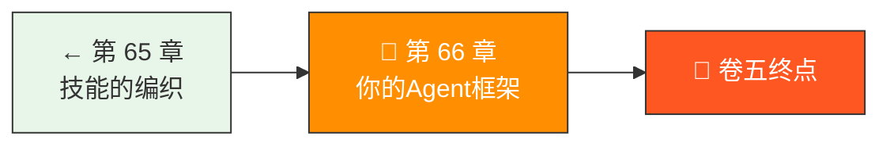
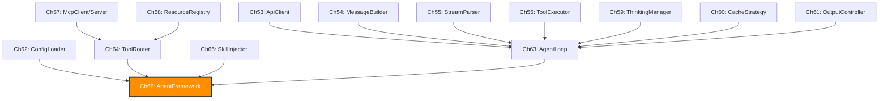

> 卷五协议验证日期：2026-05-17，基于全书协议实现

从第 53 章的一个 HTTP 请求，到现在——一个完整、可运行、可发布的 Agent 框架。这一章把所有的组件编织到一起。

---

## 路线图



---

## 回顾：十四步构建的组件树



---

## AgentFramework — 顶层入口

```typescript
// → src/my-agent/framework.ts
import { ApiClient, type ApiClientConfig } from "./api-client";
import { AgentLoop, type AgentConfig } from "./agent-loop";
import { ToolRouter, type ToolDescriptor } from "./tools/router";
import { ParallelScheduler } from "./tools/scheduler";
import { SubAgentSpawner } from "./subagent/spawner";
import { SkillLoader, SkillInjector } from "./skills";
import { ConfigLoader, type AgentConfig as AppConfig } from "./config";
import { McpClient } from "./mcp/client";

export class AgentFramework {
  // 核心组件
  readonly config: AppConfig;
  readonly client: ApiClient;
  readonly router: ToolRouter;
  readonly scheduler: ParallelScheduler;
  readonly skills: { loader: SkillLoader; injector: SkillInjector };
  readonly subAgents: SubAgentSpawner;

  // MCP 连接
  private mcpClients = new Map<string, McpClient>();

  constructor(config: AppConfig) {
    this.config = config;

    // 1. API Client
    this.client = new ApiClient({
      apiKey: config.apiKey!,
      baseUrl: config.baseUrl,
    });

    // 2. Tool Router
    this.router = new ToolRouter();

    // 3. Parallel Scheduler
    this.scheduler = new ParallelScheduler(this.router);

    // 4. Skill System
    this.skills = {
      loader: new SkillLoader(),
      injector: new SkillInjector(new SkillLoader()),
    };

    // 5. SubAgent Spawner
    this.subAgents = new SubAgentSpawner(this.client);
  }

  // === 初始化 ===

  async initialize(): Promise<void> {
    // 加载 Skills
    await this.skills.loader.loadFromDirectory("./skills");

    // 连接 MCP Servers
    if (this.config.mcpServers) {
      for (const [name, serverConfig] of Object.entries(this.config.mcpServers)) {
        if (serverConfig.type === "stdio") {
          const mcpClient = new McpClient(serverConfig.command!, serverConfig.args!);
          await mcpClient.initialize();
          await mcpClient.listTools();
          this.router.registerMcp(mcpClient);
          this.mcpClients.set(name, mcpClient);
        }
      }
    }
  }

  // === 创建 Agent ===

  createAgent(options?: {
    systemPrompt?: string;
    tools?: ToolDescriptor[];
    skills?: string[];
    model?: string;
  }): AgentLoop {
    // 注册额外工具
    if (options?.tools) {
      for (const tool of options.tools) {
        this.router.register(tool);
      }
    }

    // 构建 system prompt（注入 Skill）
    let systemPrompt = options?.systemPrompt ?? "";
    if (options?.skills) {
      const skillDefs = options.skills
        .map(name => this.skills.loader.get(name))
        .filter(Boolean) as SkillDefinition[];
      systemPrompt = this.skills.injector.buildSystemPrompt(
        systemPrompt,
        skillDefs
      );
    }

    return new AgentLoop(
      this.client,
      this.router,
      {
        model: options?.model ?? this.config.model,
        maxTokens: this.config.maxTokens ?? 4096,
        maxIterations: this.config.maxIterations ?? 25,
        maxContextTokens: 180_000,
        tools: this.router.getToolDefinitions(),
        systemPrompt,
        outputConfig: { effort: this.config.effort ?? "high" },
      }
    );
  }

  // === 工具注册便捷方法 ===

  registerTool(descriptor: ToolDescriptor): void {
    this.router.register(descriptor);
  }

  registerMcpServer(name: string, config: McpServerConfig): void {
    this.config.mcpServers ??= {};
    this.config.mcpServers[name] = config;
  }

  // === 清理 ===

  async shutdown(): Promise<void> {
    for (const [name, mcpClient] of this.mcpClients) {
      mcpClient.close();
    }
    this.mcpClients.clear();
  }
}
```

---

## 框架目录结构

```
my-agent/
├── package.json
├── tsconfig.json
├── settings.json              # Agent 配置
├── skills/                    # Skill 定义
│   ├── code-review.yaml
│   └── write-tests.yaml
└── src/
    ├── index.ts               # 入口：export AgentFramework
    ├── api-client.ts          # Ch53: HTTP Client
    ├── types.ts               # 全部类型定义
    ├── message-builder.ts     # Ch54: 消息构造
    ├── stream-parser.ts       # Ch55: 流式解析
    ├── sse-parser.ts          # Ch55: SSE 解析
    ├── tools/
    │   ├── executor.ts        # Ch56: 工具执行
    │   ├── router.ts          # Ch64: 工具路由
    │   └── scheduler.ts       # Ch64: 调度器
    ├── mcp/
    │   ├── client.ts          # Ch57: MCP Client
    │   ├── server.ts          # Ch57: MCP Server
    │   ├── bridge.ts          # Ch57: MCP→FC 桥接
    │   └── http-client.ts     # Ch57: HTTP MCP Client
    ├── thinking.ts            # Ch59: 思考解析
    ├── cache-strategy.ts      # Ch60: 缓存策略
    ├── output-controller.ts   # Ch61: 输出控制
    ├── config/
    │   ├── loader.ts          # Ch62: 配置加载
    │   └── permissions.ts     # Ch62: 权限引擎
    ├── agent-loop.ts          # Ch63: Agent 引擎
    ├── subagent/
    │   └── spawner.ts         # Ch64: 子 Agent
    ├── skills/
    │   ├── loader.ts          # Ch65: Skill 加载
    │   ├── injector.ts        # Ch65: Skill 注入
    │   └── composer.ts        # Ch65: Skill 组合
    └── framework.ts           # 顶层入口
```

---

## 使用示例：CLI Chatbot

```typescript
// → examples/cli-chatbot.ts
import { AgentFramework } from "my-agent";
import { createInterface } from "node:readline";

async function main() {
  // 加载配置
  const configLoader = new ConfigLoader();
  await configLoader.loadAll(process.cwd());
  const config = configLoader.resolve();

  // 初始化框架
  const framework = new AgentFramework(config);
  await framework.initialize();

  // 注册内置工具
  framework.registerTool({
    source: "builtin",
    definition: {
      name: "read_file",
      description: "读取文件",
      input_schema: {
        type: "object",
        properties: { path: { type: "string" } },
        required: ["path"],
      },
    },
    handler: async ({ path }) => {
      const fs = await import("node:fs/promises");
      return fs.readFile(path as string, "utf-8");
    },
  });

  // 创建 Agent
  const agent = framework.createAgent({
    systemPrompt: "你是一个终端里的编程助手。",
  });

  // 交互循环
  const rl = createInterface({ input: process.stdin, output: process.stdout });

  console.log("Agent 已就绪。输入消息，Ctrl+C 退出。\n");

  const askQuestion = () => {
    rl.question("> ", async (input) => {
      console.log("");
      for await (const event of agent.run(input)) {
        if (event.type === "response") {
          const response = event.data as { response: MessageResponse };
          const text = response.response.content
            .filter(b => b.type === "text")
            .map(b => b.text)
            .join("\n");
          console.log(text);
        } else if (event.type === "tool_call") {
          const data = event.data as { toolCalls: ToolUseBlock[] };
          console.log(`[执行工具: ${data.toolCalls.map(t => t.name).join(", ")}]`);
        }
      }
      console.log("");
      askQuestion();
    });
  };

  askQuestion();

  // 优雅关闭
  process.on("SIGINT", async () => {
    console.log("\n正在关闭...");
    await framework.shutdown();
    process.exit(0);
  });
}

main().catch(console.error);
```

---

## 使用示例：HTTP API Server

```typescript
// → examples/api-server.ts
import express from "express";
import { AgentFramework } from "my-agent";

const app = express();
app.use(express.json());

const framework = new AgentFramework(/* config */);
await framework.initialize();

app.post("/agent/run", async (req, res) => {
  const { message } = req.body;
  const agent = framework.createAgent();

  res.setHeader("Content-Type", "text/event-stream");

  for await (const event of agent.run(message)) {
    res.write(`data: ${JSON.stringify(event)}\n\n`);
    if (event.type === "response") {
      res.end();
      break;
    }
  }
});

app.listen(3000, () => console.log("Agent API on :3000"));
```

---

## 框架发布

```json
// package.json
{
  "name": "my-agent",
  "version": "1.0.0",
  "description": "一个 Anthropic 兼容的 Agent 框架",
  "main": "./dist/index.js",
  "types": "./dist/index.d.ts",
  "exports": {
    ".": "./dist/index.js",
    "./tools": "./dist/tools/index.js",
    "./mcp": "./dist/mcp/index.js",
    "./skills": "./dist/skills/index.js"
  },
  "dependencies": {
    "yaml": "^2.6.0"
  },
  "peerDependencies": {
    "@anthropic-ai/sdk": "optional"
  }
}
```

---

## 卷五的终点：十四条造物法则

| 法则 | 内容 | 章节 |
|------|------|------|
| 法则一 | 一切始于 HTTP 请求 | Ch53 |
| 法则二 | 消息不是字符串，是类型系统 | Ch54 |
| 法则三 | 流是默认，不是可选 | Ch55 |
| 法则四 | 工具调用就是另一个消息类型 | Ch56 |
| 法则五 | 协议的价值在于解耦 | Ch57 |
| 法则六 | 三原语对应三种控制权 | Ch58 |
| 法则七 | 思考是可序列化的内部状态 | Ch59 |
| 法则八 | 缓存是透明的优化层 | Ch60 |
| 法则九 | 输出的控制是一组正交维度 | Ch61 |
| 法则十 | 配置是递归覆盖的层级系统 | Ch62 |
| 法则十一 | Agent 就是循环加工具 | Ch63 |
| 法则十二 | 工具应分层路由和调度 | Ch64 |
| 法则十三 | 技能是可组合的行为模板 | Ch65 |
| 法则十四 | 框架是协议的最后一层抽象 | Ch66 |

---

## 从卷五走向何处

卷五到此结束。你现在拥有：

1. **一个完整的 Anthropic 协议实现** — Messages API、MCP、Extended Thinking、Prompt Caching、Output Config
2. **一个可工作的 Agent 引擎** — 思考-行动-观察循环，上下文管理，多轮对话
3. **一个可扩展的工具系统** — 内置工具、MCP 桥接、子 Agent 调度
4. **一个可复用的 Skill 系统** — YAML 定义、自动匹配、prompt 注入、输出验证
5. **一个可发布的框架** — 配置管理、提供商抽象、npm 包结构

接下来你可以：

- **贡献开源**：把框架发布到 npm，或向现有 Agent 框架贡献代码
- **构建产品**：在框架之上构建专用 Agent（代码审查 Agent、文档生成 Agent、测试 Agent）
- **设计协议**：基于 MCP 的扩展机制，设计新的 Agent 协议和能力
- **深入模型**：研究 prompt engineering、fine-tuning、evaluation 等模型层面的优化

> 造物主不是神——是理解法则、并用代码实现法则的人。

---

## 试试看

**任务 1**：把整个框架打包发布到 npm。在另一个项目中安装并使用。

**任务 2**：用你的框架写三个不同的 Agent——CLI 聊天、HTTP API、后台 Worker。

**任务 3**：贡献一个新的内置工具（如 `search_web`）到框架，从注册到测试走完全流程。

---

## 检查点

- [ ] 理解了 AgentFramework 的完整架构
- [ ] 能从 config → client → router → agent → skill 构建完整实例
- [ ] 能编写 CLI 和 HTTP 两种 Agent 应用
- [ ] 理解了 14 条造物法则

---

[← 上一章：第 65 章 技能的编织](/posts/e089dbc5/) | [🏠 回到目录](../README.md)
