> 你在社区里看到了无数术语：LLM、Function Calling、MCP、RAG、Agent、SubAgent、LangChain……它们是什么？互相什么关系？这篇附录帮你建立完整的认知地图。
>
> **与附录 F 的关系**：本文是**教程版**——用生活类比和可视化图表讲清概念，适合建立直觉。附录 F 是**形式化版**——用数学定义和协议规范做严格分析，适合深入研究和作为卷五的理论基础。两篇覆盖相同的六层模型，但深度和角度互补。

---

## 概念关系全景图

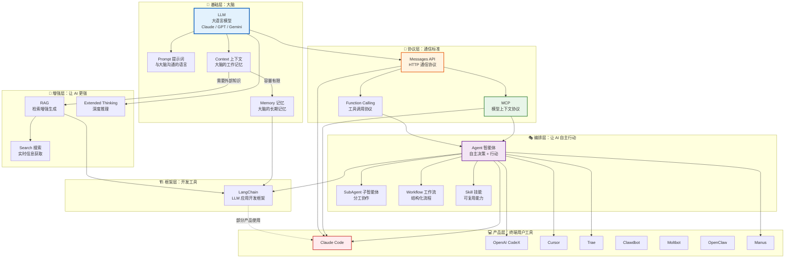

上面这张图是整个 AI 应用的分层架构。从下往上：

1. **基础层**：LLM 是核心，Prompt 是输入，Context 是工作记忆，Memory 是长期记忆
2. **协议层**：Messages API 是通信标准，Function Calling 是工具调用，MCP 是开放协议
3. **增强层**：RAG 补充知识，Search 获取实时信息，Thinking 增强推理
4. **编排层**：Agent 自主行动，SubAgent 分工协作，Workflow 结构化流程，Skill 可复用能力
5. **框架层**：LangChain 等框架简化开发
6. **产品层**：Claude Code、Cursor 等终端用户工具

下面我们一层一层展开。

---

## 第一层：基础层 — AI 的"大脑"

### LLM（Large Language Model，大语言模型）

**一句话**：一个读过几乎全部互联网文本的超级预测引擎。

LLM 的本质是"根据已有文字，预测下一个最可能出现的字"。但因为这个预测做得足够好，它表现出了理解、推理、编程、翻译等能力。

Claude、GPT、Gemini 都是 LLM。它们之间的区别在于训练数据、架构和优化方向。

**类比**：把 LLM 想象成一个博览群书的学者。他读过天文地理、文学编程，但没有互联网就不知道今天的新闻，没有工具就写不了代码。

### Prompt（提示词）

**一句话**：你跟 LLM 说话的方式。

Prompt 不是什么神秘的东西——它就是你的输入文本。但**你怎么说**，会极大地影响 LLM 的回答质量。

```text
❌ 差的 Prompt：
"写个函数"

✅ 好的 Prompt：
"用 TypeScript 写一个函数，接收一个字符串数组，返回去重后的数组。
要求：不改变原始顺序，时间复杂度 O(n)。"
```

Prompt Engineering（提示词工程）就是研究"怎么跟 LLM 说才能得到最好的回答"。在 Messages API 中，Prompt 被组织成三种角色：

| 角色 | 含义 | 类比 |
|------|------|------|
| `system` | 系统指令，定义 AI 的行为规则 | 给学者的"考试规则" |
| `user` | 用户的输入 | 你的"提问" |
| `assistant` | AI 的回复 | 学者的"回答" |

### Context（上下文）

**一句话**：LLM 一次能"看到"的文字总量——它的"工作记忆"。

每个 LLM 都有一个 **Context Window（上下文窗口）**，比如 200K tokens。你发的消息、系统指令、工具定义、AI 的回复，全部加在一起不能超过这个限制。

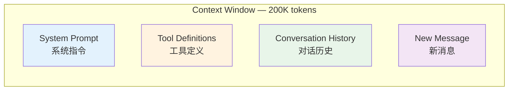

**类比**：Context 就像一张固定大小的桌子。你往上面放文件（系统指令）、工具箱（工具定义）、之前的笔记（对话历史）、新问题。桌子满了就得收走一些旧的——这就是 **Context Management（上下文管理）**。

Context 管理是所有 Agent 系统的核心挑战。Claude Code 的整个对话管线（消息打包、压缩、摘要）本质上都是在管理这个有限的窗口。

### Memory（记忆）

**一句话**：让 AI 在不同对话之间记住事情——突破 Context Window 的限制。

Context Window 是"工作记忆"——只在当前对话中存在。关掉对话就忘了。Memory 是"长期记忆"——可以跨对话持久保存。

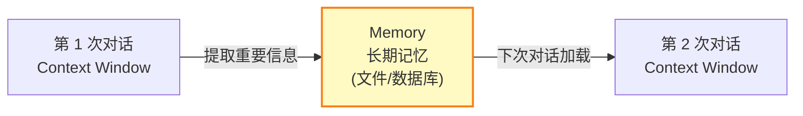

Memory 的实现方式：

| 方式 | 说明 | 示例 |
|------|------|------|
| 文件存储 | 把记忆写入文件，下次对话时读取 | Claude Code 的 `memory/` 目录 |
| 向量数据库 | 把记忆转为向量存储，语义检索时召回 | Pinecone、Chroma |
| 数据库存储 | 结构化存储，适合键值型记忆 | Redis、PostgreSQL |
| KV Store | 简单的键值对存储 | Anthropic API 的 KV Store |

---

## 第二层：协议层 — AI 的"通信标准"

### Messages API — HTTP 通信协议

**一句话**：你跟 Claude 说话的"邮政系统"——规定信封怎么写、包裹怎么装。

Messages API 是 Anthropic 提供的 HTTP REST API。所有跟 Claude 的交互，底层都是通过这个 API 完成的。

#### 请求格式

```json
POST https://api.anthropic.com/v1/messages

{
  "model": "claude-sonnet-4-5-20250929",
  "max_tokens": 4096,
  "system": "你是一个编程助手。",
  "messages": [
    { "role": "user", "content": "什么是闭包？" }
  ],
  "temperature": 0.7,
  "tools": [...],
  "thinking": {...}
}
```

#### 核心参数一览

| 参数 | 必填 | 说明 |
|------|------|------|
| `model` | 是 | 模型 ID，如 `claude-sonnet-4-5-20250929` |
| `max_tokens` | 是 | 最大生成 token 数 |
| `messages` | 是 | 对话消息数组 |
| `system` | 否 | 系统指令（字符串或数组） |
| `temperature` | 否 | 随机性，0→确定，1→创造 |
| `tools` | 否 | 工具定义数组 |
| `tool_choice` | 否 | 工具调用策略 |
| `thinking` | 否 | 扩展思考配置 |
| `stream` | 否 | 是否流式返回 |
| `cache_control` | 否 | 提示缓存配置 |
| `output_config` | 否 | 输出格式控制 |
| `stop_sequences` | 否 | 停止序列 |
| `top_k` | 否 | Top-K 采样 |
| `top_p` | 否 | Top-P 采样 |

#### 响应格式

```json
{
  "id": "msg_01XFDUDYJgAACzvnptvVo4EL",
  "type": "message",
  "role": "assistant",
  "content": [
    { "type": "text", "text": "闭包是一个函数连同其引用环境的组合..." }
  ],
  "model": "claude-sonnet-4-5-20250929",
  "stop_reason": "end_turn",
  "usage": {
    "input_tokens": 25,
    "output_tokens": 150
  }
}
```

#### 流式传输（Streaming）

不是等 AI 写完再一起返回，而是一个字一个字地飞回来。通过 `stream: true` 开启：

```typescript
const stream = await client.messages.create({
  model: 'claude-sonnet-4-5-20250929',
  max_tokens: 1024,
  messages: [{ role: 'user', content: '讲个笑话' }],
  stream: true,
});

for await (const event of stream) {
  if (event.type === 'content_block_delta') {
    process.stdout.write(event.delta.text); // 一个字一个字地输出
  }
}
```

**类比**：非流式像发电子邮件——写完再发。流式像打电话——一边想一边说，你说一句对方听一句。

#### Prompt Caching（提示缓存）

对于重复使用的 system prompt 和 tools 定义，可以用 `cache_control` 缓存，避免每次请求都重新处理：

```typescript
const response = await client.messages.create({
  model: 'claude-sonnet-4-5-20250929',
  max_tokens: 1024,
  system: [{
    type: 'text',
    text: '你是一个代码审查专家...',  // 可能几千 tokens
    cache_control: { type: 'ephemeral' }  // 缓存这段！
  }],
  tools: [{
    name: 'read_file',
    description: 'Read a file',
    input_schema: { /* ... */ },
    cache_control: { type: 'ephemeral' }  // 工具定义也缓存！
  }],
  messages: [{ role: 'user', content: '...' }],
});
```

缓存 5 分钟内有效，第二次请求时 `input_tokens` 会大幅减少，响应也更快。Claude Code 在每次对话中都用到了这个机制。

### Function Calling（函数调用 / 工具使用）

**一句话**：让 AI 不只是"说话"，还能"做事"——调用你定义的函数。

LLM 本身只能输出文字。Function Calling 让它能说"我要调用 `get_weather` 函数，参数是 `{ city: '北京' }`"。然后你执行这个函数，把结果告诉 AI，它再继续回答。

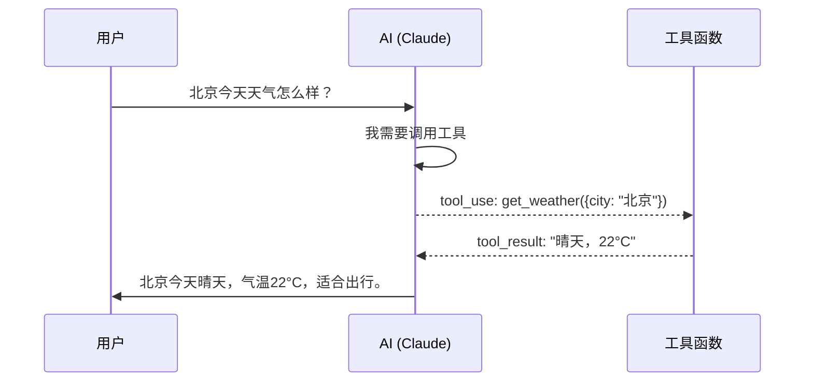

在 Messages API 中，这通过 `tools` 参数实现：

```typescript
// 1. 定义工具
const tools = [{
  name: 'get_weather',
  description: '获取指定城市的天气',
  input_schema: {
    type: 'object',
    properties: {
      city: { type: 'string', description: '城市名' }
    },
    required: ['city']
  }
}];

// 2. 发送请求（带工具定义）
const response = await client.messages.create({
  model: 'claude-sonnet-4-5-20250929',
  max_tokens: 1024,
  messages: [{ role: 'user', content: '北京天气如何？' }],
  tools: tools
});

// 3. AI 返回工具调用请求
// response.stop_reason === 'tool_use'
// response.content = [{ type: 'tool_use', name: 'get_weather', input: { city: '北京' } }]

// 4. 执行工具，把结果送回
const final = await client.messages.create({
  model: 'claude-sonnet-4-5-20250929',
  max_tokens: 1024,
  messages: [
    { role: 'user', content: '北京天气如何？' },
    { role: 'assistant', content: response.content },
    { role: 'user', content: [{
      type: 'tool_result',
      tool_use_id: response.content[0].id,
      content: '晴天，22°C'
    }]}
  ],
  tools: tools
});
```

`tool_choice` 参数控制 AI 如何使用工具：

| 值 | 行为 |
|------|------|
| `auto` | AI 自己决定是否用工具（默认） |
| `any` | 必须用某个工具 |
| `none` | 禁止使用工具 |
| `{ type: 'tool', name: '...' }` | 必须用指定的工具 |

**这是 Agent 的基础**。没有 Function Calling，AI 就只能说话；有了它，AI 就能行动。Claude Code 的 `Read`、`Write`、`Edit`、`Bash` 等工具，本质上都是通过 Function Calling 实现的。

### MCP（Model Context Protocol，模型上下文协议）

**一句话**：Anthropic 推出的开放标准——让任何 AI 应用能连接任何外部数据源和工具，就像 USB-C 统一了充电口。

Function Calling 解决了"AI 能调用工具"的问题，但每个应用的工具定义方式不同。MCP 要解决的是标准化问题：定义一个统一的协议，让 AI 应用（Client）能以标准方式连接工具和数据（Server）。

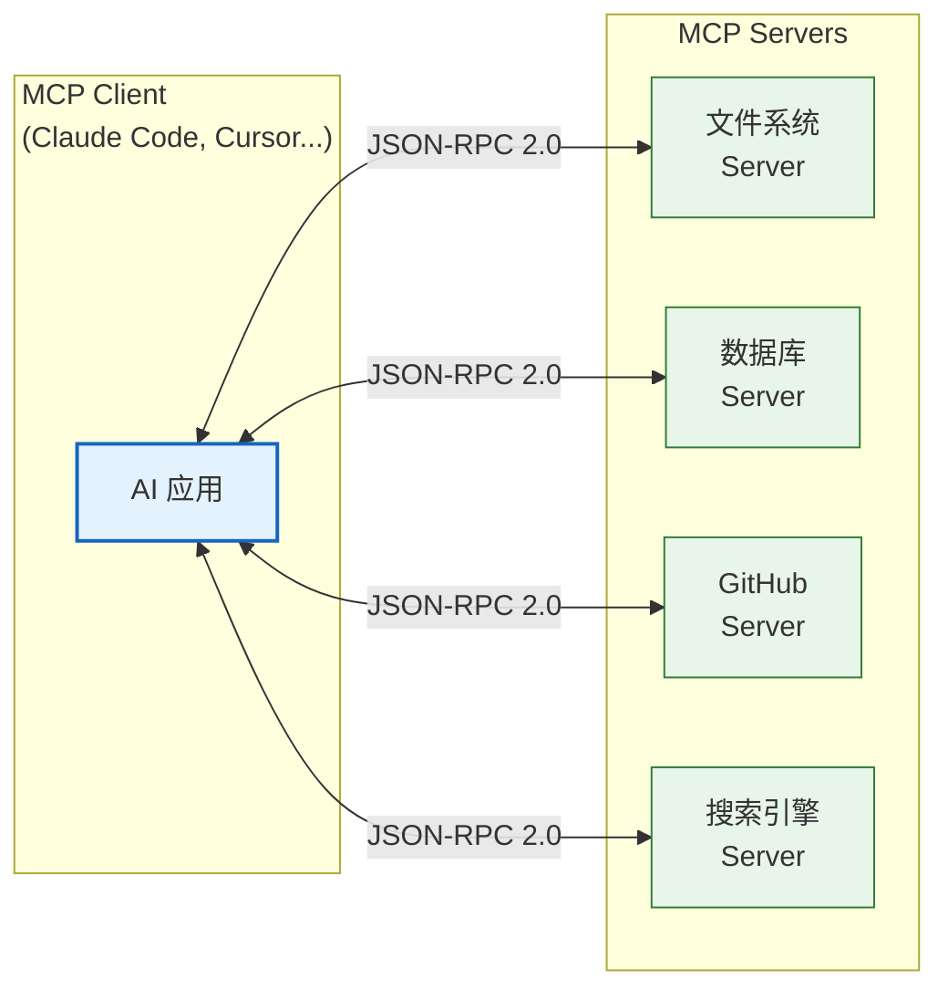

#### MCP 的三大原语

| 原语 | 方向 | 说明 | 类比 |
|------|------|------|------|
| **Tools** | Client → Server | 让 AI 调用 Server 上的操作（有副作用） | 函数调用 |
| **Resources** | Server → Client | 让 AI 读取 Server 上的数据（只读） | 读文件 |
| **Prompts** | Server → Client | 提供可复用的提示词模板 | 提示词模板库 |

#### MCP 协议栈

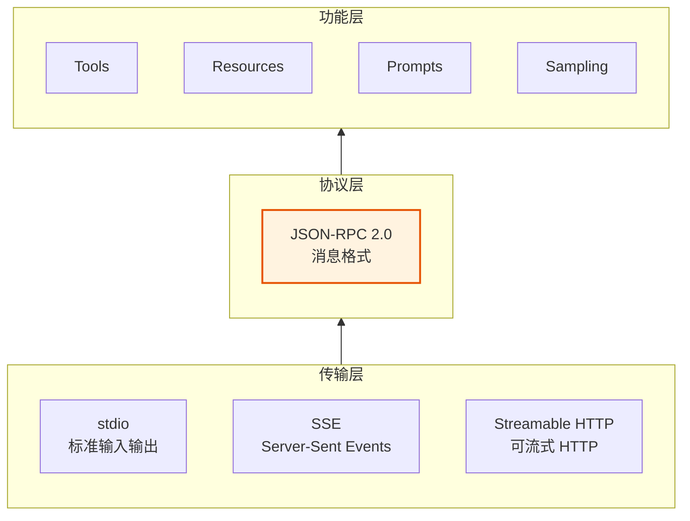

- **传输层**：MCP 支持多种传输方式——stdio（本地进程通信）、SSE（HTTP 长连接）、Streamable HTTP
- **协议层**：所有消息遵循 JSON-RPC 2.0 格式
- **功能层**：在协议之上提供 Tools、Resources、Prompts 等能力

#### MCP vs Function Calling

| 维度 | Function Calling | MCP |
|------|-----------------|-----|
| 定义者 | 各家 API 各自定义 | Anthropic 推出的开放标准 |
| 调用方式 | 嵌入在 Messages API 请求中 | 独立的 JSON-RPC 协议 |
| 工具来源 | 你自己定义和实现 | 任何 MCP Server 都能提供 |
| 生态 | 每个 API 供应商不同 | 统一协议，跨应用通用 |
| 关系 | **MCP 底层仍然使用 Function Calling** | MCP 是 Function Calling 的标准化升级 |

**关键理解**：MCP 并不替代 Function Calling。MCP Server 提供的工具，最终会被转换成 Function Calling 的 `tools` 参数，发送给 LLM。MCP 解决的是"工具如何注册、发现、通信"的标准化问题。

---

## 第三层：增强层 — 让 AI 更强

### RAG（Retrieval-Augmented Generation，检索增强生成）

**一句话**：LLM 不知道你公司的内部文档？RAG 让它先"查资料"再回答。

LLM 的知识来自训练数据，有截止日期。你问"我们公司最新的报销政策是什么"，它不知道。RAG 的思路很简单：

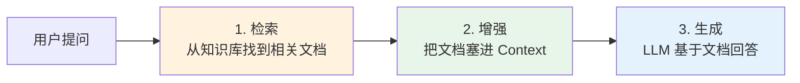

1. **检索（Retrieval）**：把用户的问题转化为向量，在向量数据库中搜索相关文档
2. **增强（Augmentation）**：把找到的文档放进 Context Window
3. **生成（Generation）**：LLM 基于这些文档生成回答

**类比**：开卷考试。LLM 是考生，RAG 是允许你翻课本。考生（LLM）有理解能力，课本（知识库）提供事实。

RAG 解决的核心问题是 **Context 的局限性**——LLM 知道很多但不是全知，RAG 帮它在需要时找到外部知识。

### Search（搜索）

**一句话**：让 AI 获取互联网上的实时信息。

Search 是一种特殊的"工具"。LLM 本身无法上网，但你可以给它一个搜索工具。当它需要最新信息时，调用搜索工具获取结果。

在 MCP 生态中，搜索经常作为一个 MCP Server 提供。在 Claude Code 中，搜索工具（如 `WebSearch`、`WebFetch`）让 AI 能实时获取信息。

Search 和 RAG 的区别：

| 维度 | RAG | Search |
|------|-----|--------|
| 数据源 | 私有知识库（你的文档） | 公开互联网 |
| 实时性 | 取决于知识库更新 | 实时 |
| 目的 | 注入领域知识 | 获取最新信息 |

### Extended Thinking（扩展思考）

**一句话**：让 Claude 在回答之前先"想一想"——把推理过程显式化。

Messages API 的 `thinking` 参数让 Claude 在回答前进行内部推理：

```typescript
const response = await client.messages.create({
  model: 'claude-sonnet-4-5-20250929',
  max_tokens: 16000,
  thinking: {
    type: 'enabled',      // 开启思考
    budget_tokens: 8000,  // 分配给思考的 token 预算
  },
  messages: [{ role: 'user', content: '证明素数有无穷多个' }],
});

// response.content = [
//   { type: 'thinking', thinking: '用户要求证明素数无穷...' },  // 推理过程
//   { type: 'text', text: '用反证法...' }                      // 最终回答
// ]
```

也可以用 `adaptive` 模式让模型自己决定思考多少：

```typescript
thinking: { type: 'adaptive' }
```

**类比**：普通模式像脱口而出，Thinking 模式像先在草稿纸上算一遍再回答。

---

## 第四层：编排层 — 让 AI 自主行动

### Agent（智能体）

**一句话**：LLM + 工具 + 循环 = Agent。能自己思考、自己决定用什么工具、自己检查结果的 AI。

这是本书的核心主题。一个 Agent 的运行流程：

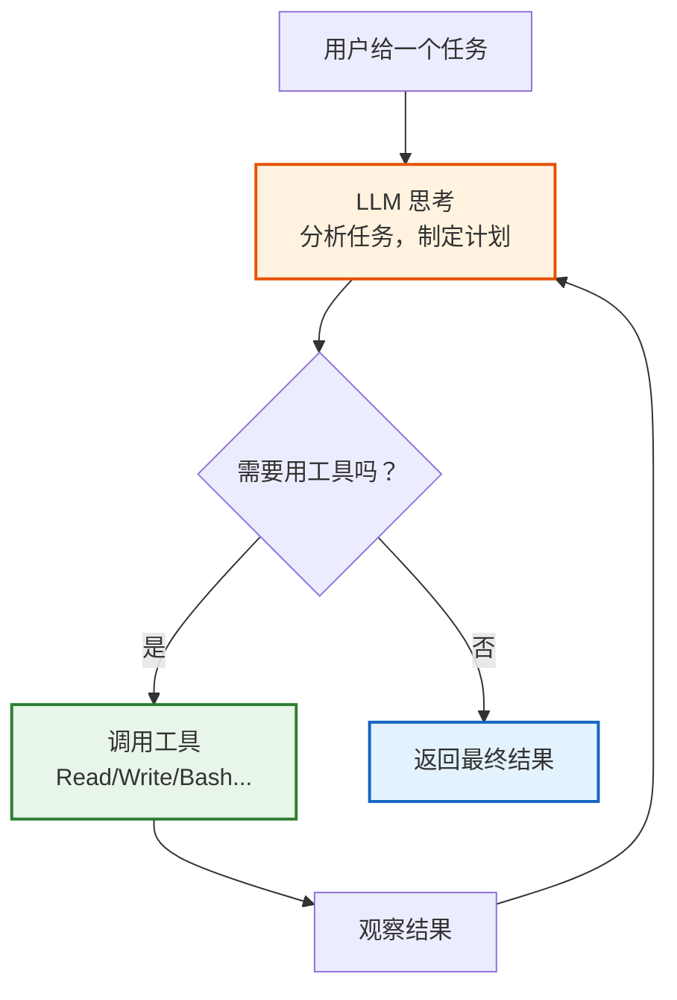

这就是第 2 章讲的 Agentic Loop。Agent 不是一个具体的技术，而是一种 **架构模式**：

- **LLM** 充当"大脑"，负责思考和决策
- **Function Calling / MCP Tools** 充当"手脚"，负责执行
- **循环** 把思考和行动串联起来，让 AI 持续工作直到任务完成

Claude Code 就是一个 Agent。它接收你的请求，自己决定读哪些文件、执行什么命令、修改哪些代码，循环往复直到完成任务。

### SubAgent（子智能体）

**一句话**：一个 Agent 可以派生出多个子 Agent，分工协作完成复杂任务。

当你对 Claude Code 说"重构整个模块"时，它可能会把任务拆分成多个子任务，每个子任务派给一个 SubAgent：

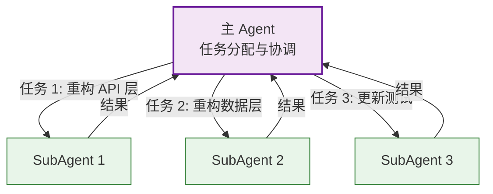

SubAgent 的工作方式：
1. 主 Agent 把任务和必要的 Context 传给 SubAgent
2. SubAgent 独立运行，有自己的 Context Window
3. SubAgent 完成后，把结果汇报给主 Agent
4. 主 Agent 汇总所有结果

**类比**：项目经理（主 Agent）把大任务拆给多个开发人员（SubAgent），每个人独立工作，最后汇总。好处是 SubAgent 各有独立的 Context Window，不会互相干扰。

### Workflow（工作流）

**一句话**：预定义的、结构化的任务执行流程——比 Agent 更可控，比硬编码更灵活。

Agent 是"自主决策"——AI 自己决定下一步做什么。Workflow 是"流程控制"——你预定义了步骤和分支：

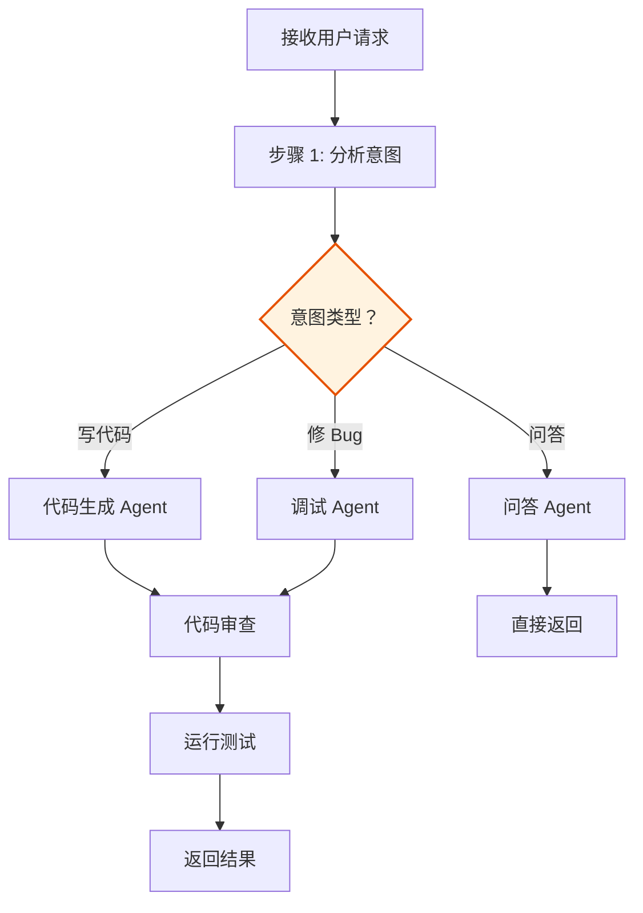

| 维度 | Agent | Workflow |
|------|-------|----------|
| 决策方式 | AI 自主决策 | 预定义流程 |
| 灵活性 | 高 | 中 |
| 可控性 | 中 | 高 |
| 适用场景 | 开放式任务 | 结构化任务 |

实际中经常混合使用：Workflow 定义大的流程框架，每个节点内部由 Agent 自主执行。

### Skill（技能）

**一句话**：可复用的、打包好的 Agent 能力——像插件一样即插即用。

Skill 把一个特定能力封装成可复用的单元：

```
Skill = Prompt 模板 + 工具集 + 执行策略 + 验证规则
```

比如 Claude Code 中的 Skills 系统：

| Skill 名称 | 做什么 | 内含什么 |
|------------|--------|---------|
| `brainstorming` | 头脑风暴 | 特定的 Prompt 模板 + 引导策略 |
| `test-driven-development` | TDD 开发 | 红-绿-重构循环 + 测试工具 |
| `systematic-debugging` | 系统化调试 | 调试流程 + 诊断工具 |

Skill 让 Agent 的行为可预测、可复用、可组合。

---

## 第五层：框架层 — 开发工具

### LangChain

**一句话**：一个开源框架，帮你用 LLM 构建应用——提供 Chain、Agent、Memory、RAG 等组件的现成实现。

LangChain 是一个"胶水框架"，它不提供 LLM 本身，而是提供连接 LLM 和各种工具/数据源的组件：

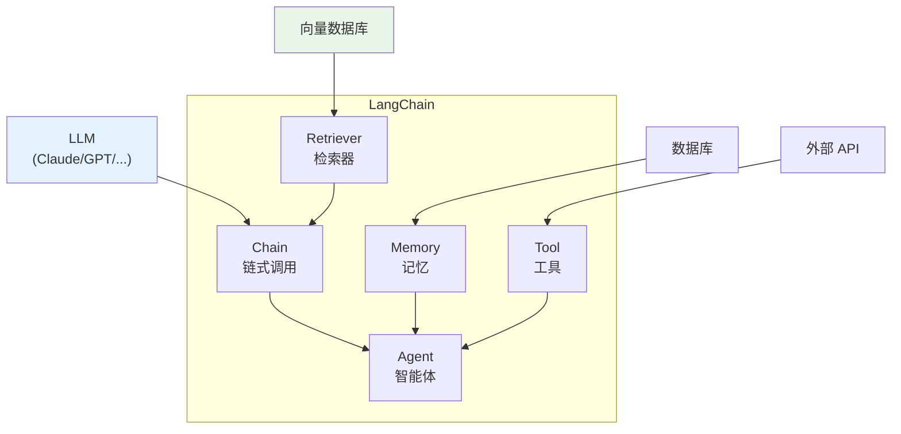

LangChain 的核心抽象：

| 组件 | 说明 | 对应我们的概念 |
|------|------|---------------|
| Chain | 把多个步骤串起来 | Workflow |
| Agent | 自主决策 + 工具调用 | Agent |
| Memory | 管理对话历史 | Memory |
| Retriever | 从知识库检索文档 | RAG 的检索部分 |
| Tool | 外部工具的封装 | Function Calling |

**类比**：如果 LLM 是发动机，LangChain 就是一个汽车底盘——它帮你把发动机、轮子、方向盘组合在一起，你只需要关心"去哪"。

---

## 第六层：产品层 — 终端用户工具

这些是直接面向用户的 AI 编程工具。它们底层都是 Agent 架构，但各有侧重：

| 工具 | 开发者 | 特点 | 底层模型 |
|------|--------|------|----------|
| **Claude Code** | Anthropic | CLI 原生 Agent，深度集成终端 | Claude |
| **Cursor** | Anysphere | IDE 集成，Tab 补全 | 多模型可选 |
| **CodeX** | OpenAI | CLI Agent，沙箱执行 | GPT |
| **Trae** | 字节跳动 | IDE，中文生态 | 多模型可选 |
| **Clawdbot** | 社区 | Claude 生态工具 | Claude |
| **Moltbot** | 社区 | 轻量 Agent 框架 | 多模型 |
| **OpenClaw** | 社区 | 开源 Claude 工具 | Claude |
| **Manus** | Manus AI | 通用 Agent，多场景 | 多模型 |

它们之间的关系图：

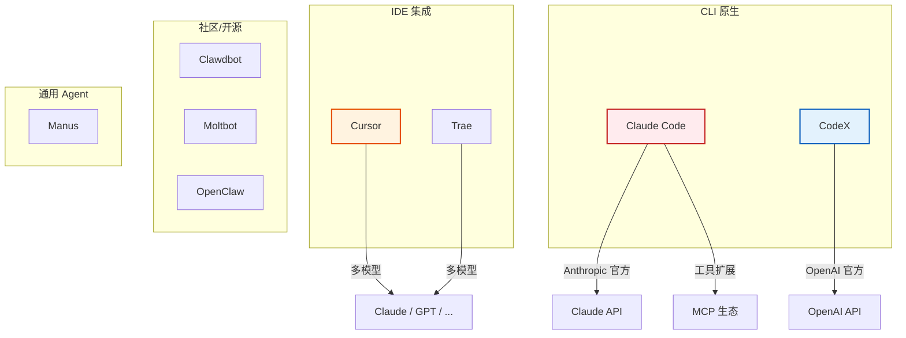

---

## 四大 Anthropic 协议详解

上面我们按层次梳理了所有概念。现在聚焦 Anthropic 的四大协议，深入看它们各自解决什么问题。

### 协议一：Messages API — 与 Claude 通信的 HTTP 接口

Messages API 是你与 Claude 交互的基础协议。所有上层产品（Claude Code、Claude.ai）底层都通过它通信。

#### 完整的请求生命周期

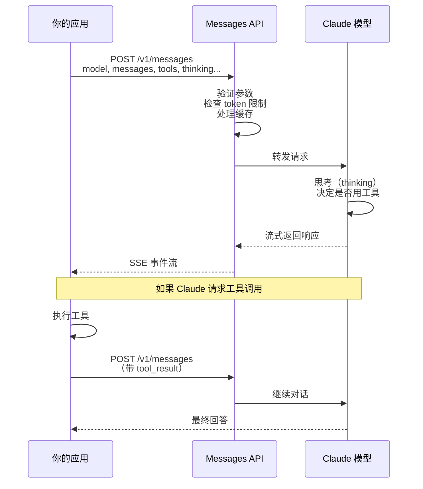

#### 响应中的 Content Block 类型

Claude 的回答不是一段纯文本，而是一个 **Content Block 数组**，每个 block 有不同类型：

```typescript
// 纯文本回答
{ type: 'text', text: '你好！' }

// 工具调用
{ type: 'tool_use', id: 'toolu_xxx', name: 'get_weather', input: { city: '北京' } }

// 扩展思考
{ type: 'thinking', thinking: '用户问的是天气...' }
```

一次回答可以包含多个 block：

```json
{
  "content": [
    { "type": "thinking", "thinking": "让我分析一下..." },
    { "type": "text", "text": "根据分析，" },
    { "type": "tool_use", "name": "search", "input": { "query": "最新数据" } }
  ]
}
```

#### Anthropic API 扩展参数

Messages API 有一些高级参数，它们不是"标准 LLM API"的一部分，而是 Anthropic 的扩展：

##### `thinking` — 扩展思考

```json
{
  "thinking": {
    "type": "enabled",        // 或 "adaptive"
    "budget_tokens": 8000,    // 思考的 token 预算（仅 type=enabled 时）
    "display": "summarized"   // 可选：是否在响应中包含思考摘要
  }
}
```

- `type: "enabled"` + `budget_tokens`：固定预算模式
- `type: "adaptive"`：模型自行决定思考多少

##### `cache_control` — 提示缓存

```json
{
  "cache_control": {
    "type": "ephemeral",  // 缓存类型（目前只有 ephemeral）
    "ttl": "5m"           // 缓存有效期："5m" 或 "1h"
  }
}
```

可以加在 system prompt blocks 和 tools 上。缓存命中时，`usage` 中会显示：

```json
{
  "usage": {
    "input_tokens": 100,           // 新增 token
    "cache_read_input_tokens": 5000,   // 从缓存读取的 token（便宜 90%）
    "cache_creation_input_tokens": 5000 // 首次写入缓存的 token（贵 25%）
  }
}
```

##### `output_config` — 输出控制

```json
{
  "output_config": {
    "effort": "low",           // 或 "medium", "high" — 控制输出努力程度
    "format": {
      "type": "json_schema",   // 强制 JSON 输出
      "schema": { /* JSON Schema */ }
    }
  }
}
```

- `effort`：控制模型在回答上投入多少推理能力。`low` 快但简略，`high` 慢但全面
- `format`：强制输出符合特定 JSON Schema 的结构化数据

### 协议二：MCP — 模型上下文协议

MCP 的核心是三个原语和一套生命周期管理。

#### 生命周期

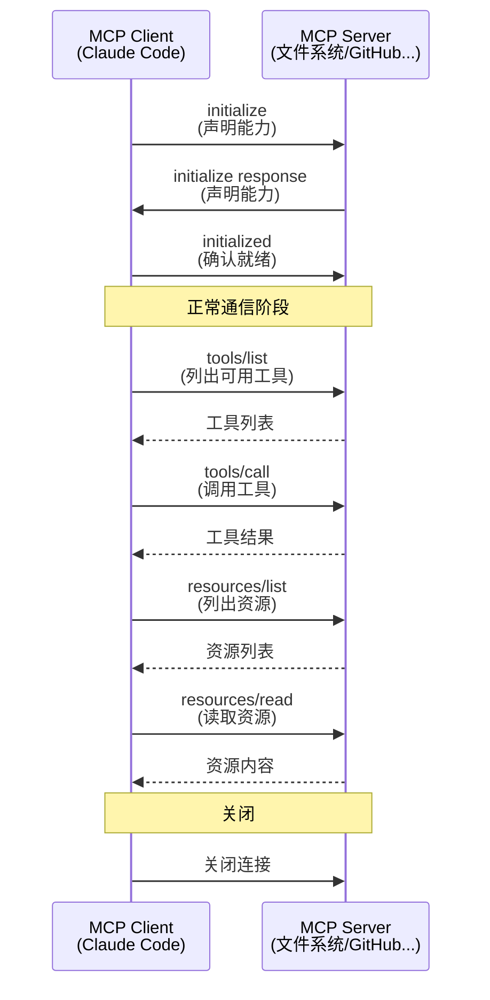

#### 能力协商

Client 和 Server 在初始化时声明各自支持的能力：

```json
// Client 能力
{
  "capabilities": {
    "roots": { "listChanged": true },    // 可以提供文件根目录
    "sampling": {}                        // 可以让 Server 触发 LLM 采样
  }
}

// Server 能力
{
  "capabilities": {
    "tools": { "listChanged": true },     // 提供工具，且工具列表会变化
    "resources": { "subscribe": true },   // 提供资源，支持订阅更新
    "prompts": { "listChanged": true },   // 提供提示模板
    "logging": {}                         // 支持日志
  }
}
```

#### MCP 消息格式（JSON-RPC 2.0）

```json
// 请求
{
  "jsonrpc": "2.0",
  "id": 1,
  "method": "tools/call",
  "params": {
    "name": "read_file",
    "arguments": { "path": "/src/index.ts" }
  }
}

// 响应
{
  "jsonrpc": "2.0",
  "id": 1,
  "result": {
    "content": [
      { "type": "text", "text": "文件内容..." }
    ]
  }
}
```

#### MCP 如何融入 Agent 系统

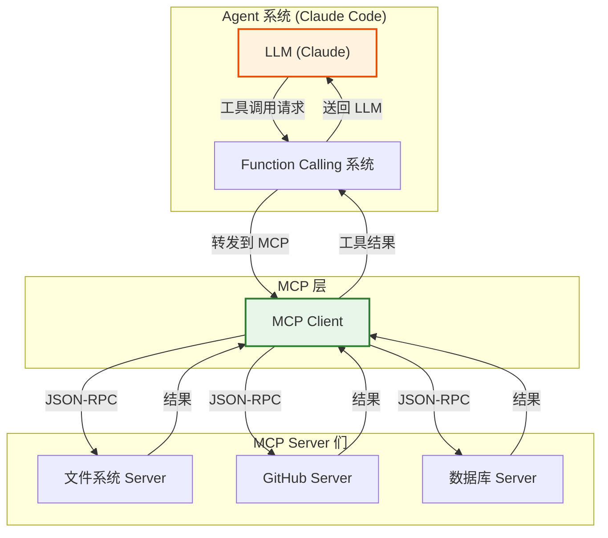

关键流程：
1. LLM 产生 `tool_use`（Function Calling）
2. Agent 的工具路由系统判断这是一个 MCP 工具
3. 调用 MCP Client，通过 JSON-RPC 请求 MCP Server
4. Server 返回结果
5. 结果被包装为 `tool_result`，送回 LLM

### 协议三：Claude CLI 配置协议

Claude Code 的配置系统定义了如何自定义模型、工具、权限等。

#### 配置文件层级

```
~/.claude/settings.json              # 全局配置
~/.claude/settings.local.json        # 全局本地配置（不提交 Git）
~/.claude/projects/<path>/settings.json  # 项目级配置
.claude/settings.json                 # 项目目录级配置（可提交 Git）
.claude/settings.local.json           # 项目目录本地配置
```

优先级从低到高：全局 < 全局本地 < 项目级 < 项目目录级。

#### 模型配置

```json
{
  "model": "claude-sonnet-4-5-20250929",
  "smallModel": "claude-haiku-4-5-20251001",
  "largeModel": "claude-opus-4-6"
}
```

Claude Code 支持多模型切换：主模型处理复杂任务，小模型处理轻量任务（如分类、摘要）。

#### MCP Server 配置

```json
{
  "mcpServers": {
    "filesystem": {
      "command": "npx",
      "args": ["-y", "@modelcontextprotocol/server-filesystem", "/path/to/dir"],
      "env": {}
    },
    "github": {
      "command": "npx",
      "args": ["-y", "@modelcontextprotocol/server-github"],
      "env": { "GITHUB_TOKEN": "xxx" }
    }
  }
}
```

#### 权限配置

```json
{
  "permissions": {
    "allow": [
      "Bash(ls *)",
      "Bash(git status)",
      "Read(*)",
      "mcp__filesystem__*"
    ],
    "deny": [
      "Bash(rm -rf *)"
    ]
  }
}
```

### 协议四：扩展能力参数汇总

| 参数 | 位置 | 作用 |
|------|------|------|
| `thinking` | 请求体 | 控制扩展思考 |
| `cache_control` | system/tools 上 | 控制提示缓存 |
| `output_config` | 请求体 | 控制输出格式和努力程度 |
| `tool_choice` | 请求体 | 控制工具使用策略 |
| `metadata` | 请求体 | 附加元数据（如 user_id） |
| `service_tier` | 请求体 | 服务级别（auto/manual） |
| `stop_sequences` | 请求体 | 自定义停止序列 |
| `container` | 请求体 | 代码执行容器 |
| `citations` | system block | 引用标注 |

---

## 概念速查表

最后，一张表把所有概念串起来：

| 概念 | 一句话 | 属于哪层 | 解决什么问题 |
|------|--------|---------|-------------|
| **LLM** | 大语言模型，AI 的"大脑" | 基础层 | 提供理解和生成能力 |
| **Prompt** | 跟 AI 沟通的方式 | 基础层 | 控制 AI 的输出 |
| **Context** | AI 一次能看到的文字量 | 基础层 | 限制→需要管理策略 |
| **Memory** | 跨对话的持久记忆 | 基础层 | 突破 Context 的时间限制 |
| **Messages API** | HTTP 通信协议 | 协议层 | 标准化与 LLM 的通信 |
| **Function Calling** | 工具调用协议 | 协议层 | 让 LLM 能调用外部函数 |
| **MCP** | 开放的工具连接标准 | 协议层 | 标准化工具注册和通信 |
| **RAG** | 检索+生成 | 增强层 | 注入外部知识 |
| **Search** | 实时搜索 | 增强层 | 获取最新信息 |
| **Thinking** | 扩展思考 | 增强层 | 提升推理质量 |
| **Agent** | LLM + 工具 + 循环 | 编排层 | 自主完成复杂任务 |
| **SubAgent** | 子智能体 | 编排层 | 分工协作 |
| **Workflow** | 结构化流程 | 编排层 | 可控的多步骤执行 |
| **Skill** | 可复用能力 | 编排层 | 封装和复用 Agent 能力 |
| **LangChain** | LLM 应用框架 | 框架层 | 简化 LLM 应用开发 |

---

## 从概念到实践：一个完整的调用链

现在让我们把所有概念串起来，看一个真实的调用链——当你在 Claude Code 中输入"帮我修复这个 bug"时：

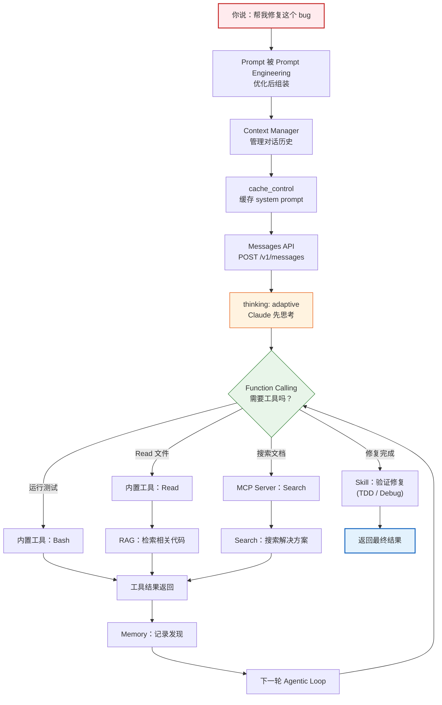

在这个流程中，几乎所有概念都出场了：

1. **LLM** — Claude 在思考
2. **Prompt** — 系统指令引导 AI 的行为
3. **Context** — 管理有限的上下文窗口
4. **Memory** — 记住之前的发现
5. **Messages API** — HTTP 请求发送给 Claude
6. **Function Calling** — AI 决定调用什么工具
7. **MCP** — 搜索工具通过 MCP Server 提供
8. **RAG** — 从项目代码中检索相关上下文
9. **Search** — 搜索互联网上的解决方案
10. **Thinking** — Claude 先思考再行动
11. **Agent** — 整个自主循环
12. **Skill** — 用 TDD 流程验证修复
13. **Prompt Caching** — 缓存系统指令减少成本

---

> **一句话总结**：LLM 是大脑，Messages API 是嘴巴，Function Calling 是手，MCP 是标准化的工具箱，RAG 是课本，Context 是工作记忆，Memory 是笔记本，Agent 是"让大脑用工具自主干活"的架构，SubAgent 是分工，Workflow 是流程，Skill 是可复用的技能，LangChain 是积木，Claude Code/Cursor/... 是最终产品。
