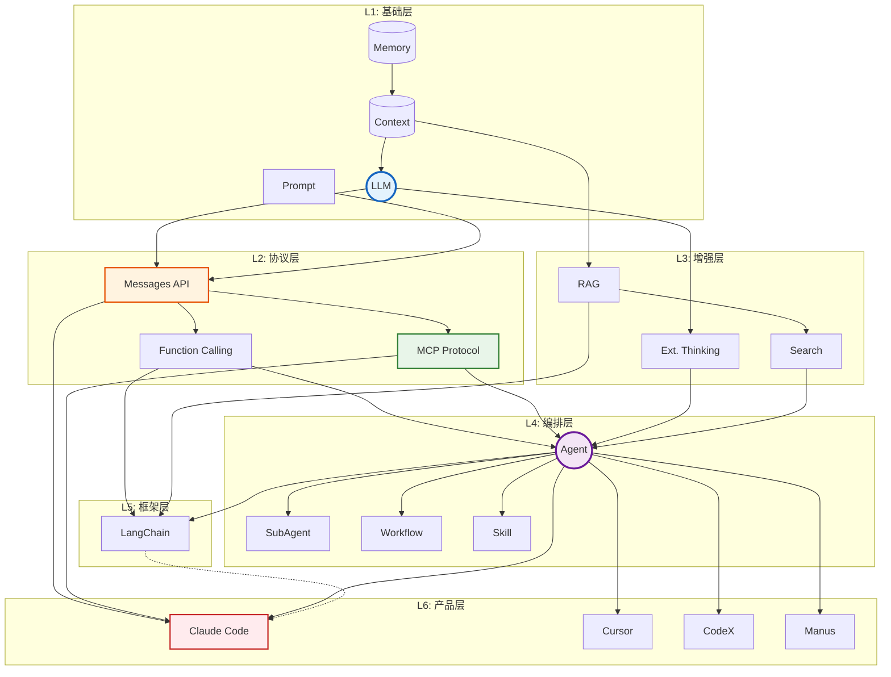
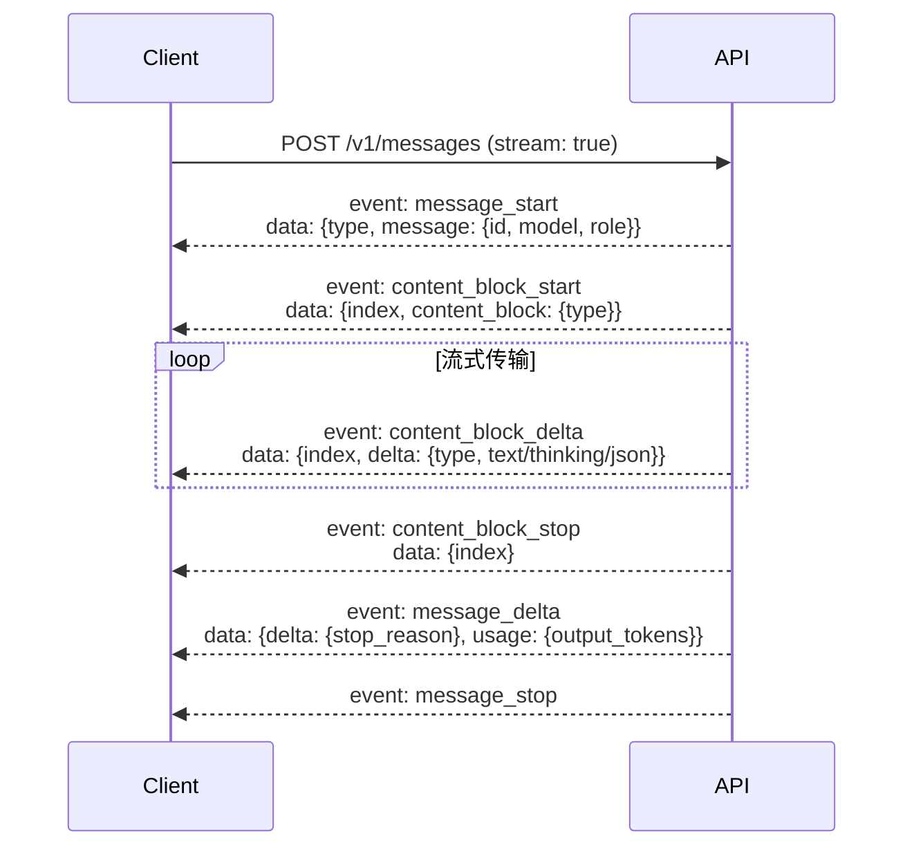
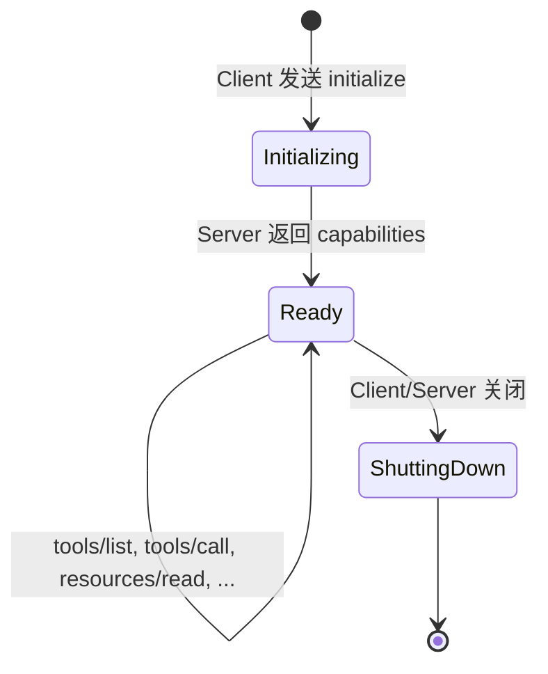
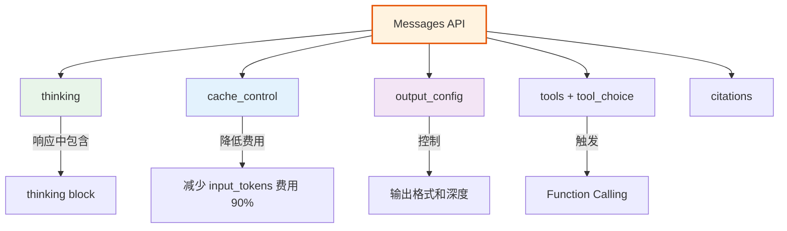
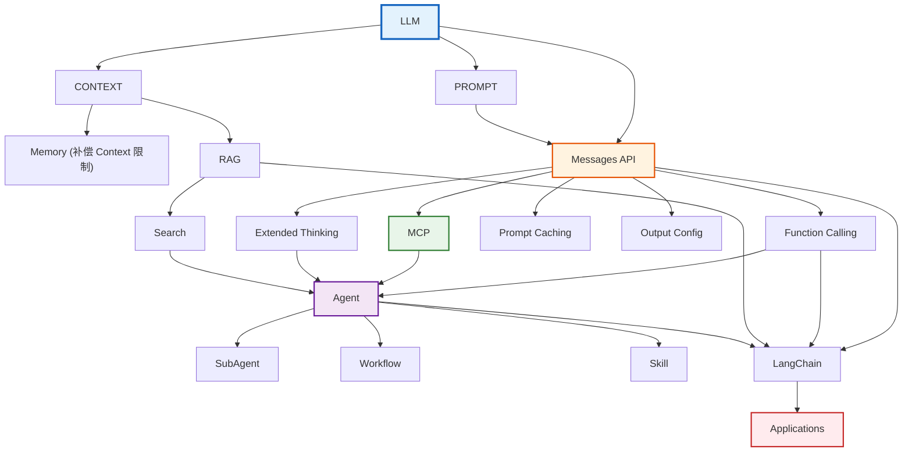
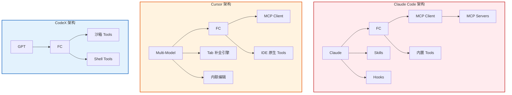
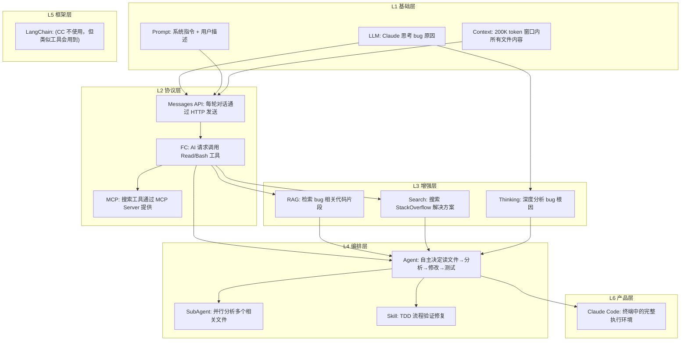
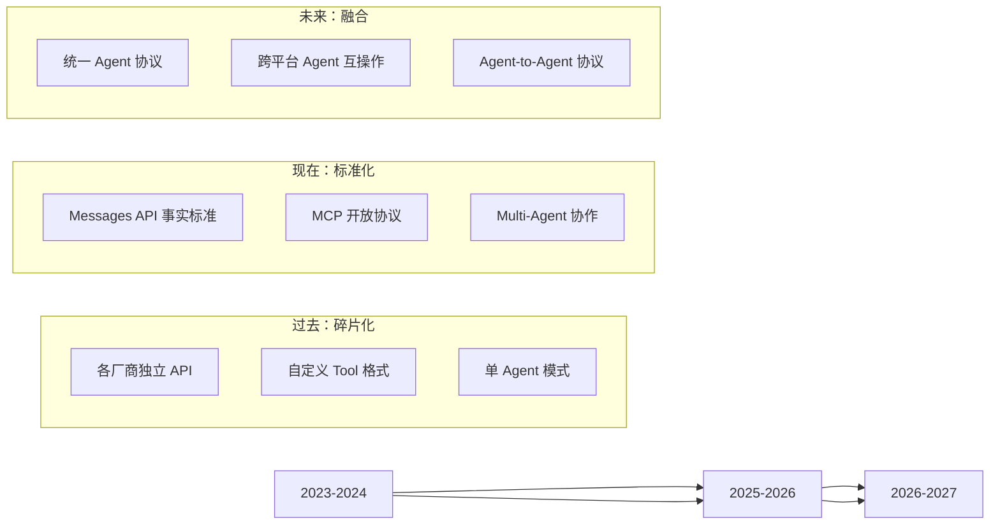

> 飞天闪客

> **摘要**：本文对当前 AI Agent 生态系统中的核心概念进行形式化定义与关系分析。采用分层架构模型，从基础计算抽象（LLM）到终端产品（Claude Code / Cursor / Manus）共六层，逐一分析每层概念的形式语义、层间依赖关系与协议规范。特别对 Anthropic Messages API、Model Context Protocol（MCP）、扩展功能字段及 Claude CLI 配置协议进行完整的规范级分析。
>
> **与附录 E 的关系**：本文是**形式化版**——用数学定义、关系矩阵和协议规范分析建立严格的概念模型，是卷五（从零构建 Agent 框架）的理论基础。附录 E 是**教程版**——用可视化图表和生活类比讲清同样的六层模型，适合初次接触时建立直觉。建议先读附录 E 建立全景认知，再读本文深入形式化细节。

---

## 1. 引言

2024-2026 年间，AI Agent 领域涌现了大量术语与概念。这些概念来自不同层面——从底层模型能力到上层产品形态——彼此之间存在复杂的依赖、包含、组合与替代关系。本文的目标是：

1. 给出每个概念的形式化定义
2. 建立概念之间的精确关系模型
3. 对 Anthropic 四大协议进行规范级分析
4. 提供一个可验证的概念关系拓扑

---

## 2. 概念的形式化定义

### 2.1 基础计算抽象

**定义 2.1（LLM，Large Language Model）**：一个 LLM 是从 token 序列到 token 概率分布的参数化函数：

$$\mathcal{M}: \mathcal{T}^* \rightarrow \Delta(\mathcal{T})$$

其中 $\mathcal{T}$ 是 token 词汇表，$\Delta(\mathcal{T})$ 是 $\mathcal{T}$ 上的概率单纯形。给定输入序列 $x \in \mathcal{T}^*$，模型输出下一个 token 的概率分布 $P(t_{n+1} | t_1, \ldots, t_n)$。

关键约束：$\mathcal{M}$ 受限于上下文窗口 $W_{\text{max}}$（以 token 计），即有效输入 $|x| \leq W_{\text{max}}$。

**实例**：Claude 4.7 Sonnet ($W_{\text{max}} = 200\text{K}$)，GPT-4.1 ($W_{\text{max}} = 1\text{M}$)，Gemini 2.5 Pro ($W_{\text{max}} = 1\text{M}$)。

**定义 2.2（Prompt）**：Prompt $p$ 是从自然语言意图到 token 序列的映射函数：

$$p: \text{Intent} \times \text{Role} \rightarrow \mathcal{T}^*$$

其中 $\text{Role} \in \{\text{system}, \text{user}, \text{assistant}\}$。System prompt 设定行为边界，user prompt 表达任务，assistant prompt 提供历史。

**定义 2.3（Context）**：一次推理的上下文 $C$ 是所有输入 token 的有序集合：

$$C = S \oplus D \oplus H \oplus Q$$

其中 $S$ 为 system prompt、$D$ 为 tool definitions、$H$ 为对话历史、$Q$ 为当前 query，$\oplus$ 为序列拼接操作。约束：$|C| \leq W_{\text{max}}$。

**定义 2.4（Memory）**：Memory 是跨会话边界的持久化状态存储：

$$\text{Mem}: \text{SessionId} \times \text{Query}(K) \rightarrow \text{Value}(V)$$

与 Context 的区别：Context 在单次 API 调用后消失（易失），Memory 跨越多次会话持久存在（非易失）。Memory 通常实现为向量数据库（语义检索）或文件系统（结构化存储）。

### 2.2 协议抽象

**定义 2.5（Messages API）**：Messages API 是 Anthropic 定义的 HTTP RESTful 接口，形式化为：

$$\text{API}: \text{Request} \rightarrow \text{Response}$$

其中：
$$\text{Request} = (\text{model}, \text{messages}, \text{max\_tokens}, \text{system?}, \text{tools?}, \text{thinking?}, \ldots)$$
$$\text{Response} = (\text{id}, \text{content}[\text{ContentBlock}], \text{stop\_reason}, \text{usage})$$

**定义 2.6（Function Calling）**：Function Calling 是将 LLM 的输出空间从纯文本扩展到结构化函数调用的机制：

$$\text{FC}: \mathcal{T}^* \times \text{ToolDef}^* \rightarrow \text{ContentBlock}^*$$

其中 $\text{ContentBlock} \in \{\text{TextBlock}, \text{ToolUseBlock}\}$，$\text{ToolUseBlock} = (\text{id}, \text{name}, \text{input\_json})$。

Function Calling 是 Agent 能"行动"的基础——它将 LLM 从纯推理系统升级为推理-行动系统。

**定义 2.7（MCP，Model Context Protocol）**：MCP 是一个基于 JSON-RPC 2.0 的开放协议，定义 AI 应用与外部工具/数据源之间的标准化交互：

$$\text{MCP} = (\text{Transport}, \text{Lifecycle}, \text{Primitives})$$

其中：
- $\text{Transport} \in \{\text{stdio}, \text{SSE}, \text{Streamable HTTP}\}$
- $\text{Lifecycle} = (\text{initialize}, \text{initialized}, \text{shutdown})$
- $\text{Primitives} = \{\text{Tools}, \text{Resources}, \text{Prompts}\}$

MCP 与 Function Calling 的关系：MCP 是 Function Calling 的标准化升级。MCP Server 提供的工具最终被转换为 Messages API 的 `tools` 参数。关系可表示为：

$$\text{MCP.Tool} \xrightarrow{\text{translate}} \text{API.ToolDef} \xrightarrow{\text{embed}} \text{Request.tools}$$

### 2.3 增强机制

**定义 2.8（Extended Thinking）**：扩展思考是让 LLM 在生成最终回答前进行内部推理的参数化机制：

$$\text{Thinking}: \mathcal{T}^* \times \text{ThinkingConfig} \rightarrow \text{ThinkingBlock}^* \times \text{TextBlock}^*$$

其中 $\text{ThinkingConfig} \in \{\text{enabled}(\text{budget\_tokens}), \text{adaptive}\}$。Thinking Block 的内容（`block.thinking`）是模型的内部推理过程，通常比最终回答更详细。

**定义 2.9（RAG，Retrieval-Augmented Generation）**：RAG 是通过外部知识检索增强 LLM 生成的三阶段流水线：

1. **检索阶段**：$R(q, K) = \{d_1, \ldots, d_k\}$，其中 $q$ 是 query 的向量嵌入，$K$ 是知识库
2. **增强阶段**：$C' = C \oplus \{d_1, \ldots, d_k\}$，将检索到的文档注入上下文
3. **生成阶段**：$\mathcal{M}(C')$ 基于增强后的上下文生成回答

RAG 解决的核心问题是 LLM 知识的闭集性——训练数据有截止日期，RAG 在推理时注入外部知识。

**定义 2.10（Search）**：Search 是 RAG 的一个特化实例，其知识库是实时互联网索引：

$$\text{Search}(q) = R_{\text{web}}(q, \text{WebIndex}_t)$$

其中 $t$ 表示搜索时刻，$\text{WebIndex}_t$ 是 $t$ 时刻的互联网索引快照。

### 2.4 编排抽象

**定义 2.11（Agent）**：Agent 是一个由 LLM 驱动、能在环境中自主决策并执行工具的自治系统：

$$\text{Agent} = (\mathcal{M}, \mathcal{T}_{\text{tools}}, \Pi, \text{Loop})$$

其中：
- $\mathcal{M}$ 是底层 LLM
- $\mathcal{T}_{\text{tools}}$ 是可用工具集合
- $\Pi$ 是规划/决策策略
- $\text{Loop}$ 是思考-行动-观察循环

Agent 的核心循环（Agentic Loop）：

```
while not done:
    thought = M.think(context)
    if thought.requires_tool():
        result = execute(thought.tool_call)
        context.append(result)
    else:
        return thought.final_answer
```

**定义 2.12（SubAgent）**：SubAgent 是由主 Agent 动态创建、拥有独立上下文窗口的子自治单元：

$$\text{SubAgent}_i = (\mathcal{M}, \mathcal{T}_{\text{tools}}, \Pi_i, \text{Loop}, C_i)$$

其中 $C_i$ 是独立的上下文窗口，与主 Agent 及其他 SubAgent 的上下文隔离。SubAgent 之间通过消息传递通信：

$$\text{SubAgent}_i \xrightarrow{\text{result}} \text{MainAgent}$$

**定义 2.13（Workflow）**：Workflow 是预定义的、有向无环图（DAG）结构的任务执行路径：

$$\text{Workflow} = (N, E, \text{Start}, \text{End})$$

其中 $N$ 是任务节点（每节点可内含 Agent），$E \subseteq N \times N$ 是依赖边。与 Agent 的自由循环不同，Workflow 的执行路径是预定义的。

**定义 2.14（Skill）**：Skill 是封装了特定能力的可复用 Agent 配置：

$$\text{Skill} = (\text{Prompt}_\text{template}, \mathcal{T}_\text{tools}, \text{Strategy}, \text{Validator})$$

Skill 的四个组件：
- $\text{Prompt}_\text{template}$：预定义的提示词模板，定义行为边界
- $\mathcal{T}_\text{tools}$：专属工具集
- $\text{Strategy}$：执行策略（何时使用哪些工具）
- $\text{Validator}$：验证规则（如何确认完成）

### 2.5 框架与产品

**定义 2.15（LangChain）**：LangChain 是在 Messages API 之上的中间件框架，提供 Chain、Agent、Memory、Retriever 等高层抽象：

$$\text{LangChain} = \text{Middleware}(\text{LLM API}, \{\text{Chain}, \text{Agent}, \text{Memory}, \text{Retriever}\})$$

它不提供 LLM 本身，而是提供连接 LLM 与各种工具/数据源的"胶水层"。

**定义 2.16（AI 编程工具）**：终端用户产品，是上述所有抽象的集成实例：

| 工具 | 形式化描述 |
|------|-----------|
| Claude Code | $\text{Agent}(\text{Claude}, \text{MCP Tools} \cup \text{Built-in Tools}, \text{Skills}, \text{Hooks})$ |
| Cursor | $\text{IDE} + \text{Agent}(\text{Multi-Model}, \text{MCP} \cup \text{Native Tools})$ |
| CodeX | $\text{Agent}(\text{GPT}, \text{Built-in Tools}, \text{Sandbox})$ |
| Manus | $\text{GeneralAgent}(\text{Multi-Model}, \text{Universal Tools})$ |

---

## 3. 分层架构与概念依赖关系

### 3.1 六层形式化架构

AI Agent 生态系统可建模为六层依赖架构。层 $L_i$ 只能依赖 $L_j$ 其中 $j < i$（严格分层）：

$$\text{System} = \bigoplus_{i=1}^{6} L_i, \quad L_i \rightarrow L_j \iff i > j$$

其中 $L_1$ 至 $L_6$ 依次为：

| 层 | 名称 | 核心概念 | 依赖层 |
|----|------|---------|--------|
| $L_1$ | 基础层 | LLM, Prompt, Context, Memory | — |
| $L_2$ | 协议层 | Messages API, Function Calling, MCP | $L_1$ |
| $L_3$ | 增强层 | RAG, Search, Extended Thinking | $L_1, L_2$ |
| $L_4$ | 编排层 | Agent, SubAgent, Workflow, Skill | $L_1, L_2, L_3$ |
| $L_5$ | 框架层 | LangChain | $L_2, L_3, L_4$ |
| $L_6$ | 产品层 | Claude Code, Cursor, CodeX, Manus, Trae, Moltbot, OpenClaw | $L_1-L_5$ |

### 3.2 层间关系矩阵

下表给出概念间的精确关系类型。关系类型包括：

- **⊆** ：子集关系（概念的实例化特例）
- **→** ：依赖关系（A 依赖 B 的实现）
- **⇢** ：调用关系（A 运行时调用 B）
- **≈** ：等价/同构关系（不同层的同一抽象）
- **⨁** ：组合关系（A 由 B 和其他组件组合构成）

| 概念 A | 关系 | 概念 B | 说明 |
|--------|------|--------|------|
| LLM | **基础** | 所有上层概念 | 一切 Agent 系统的计算核心 |
| Prompt | → | LLM | Prompt 是 LLM 的输入格式化层 |
| Context | **约束** | LLM | Context 限制 LLM 单次推理范围 |
| Memory | **补偿** | Context | Memory 补偿 Context 的易失性 |
| Messages API | → | LLM | API 是 LLM 的网络接口 |
| Function Calling | ⨁ | Messages API | FC 是 API 的工具使用扩展 |
| MCP | ⇢ | Function Calling | MCP 工具最终转换为 FC tools 参数 |
| RAG | ⇢ | Context | RAG 向 Context 注入外部文档 |
| Search | ⊆ | RAG | Search 是 RAG 在互联网索引上的特化 |
| Extended Thinking | → | LLM | Thinking 利用 LLM 的内部推理能力 |
| Agent | ⨁ | LLM + FC + Loop | Agent 是三要素的组合 |
| SubAgent | ⊆ | Agent | SubAgent 是 Agent 的受控实例 |
| Workflow | **结构** | Agent | Workflow 为 Agent 提供预定义执行路径 |
| Skill | **封装** | Agent | Skill 封装 Agent 能力为可复用单元 |
| LangChain | → | Messages API | LangChain 封装 API 调用为高层抽象 |
| Claude Code | ⨁ | Agent + MCP + Skill | CC 是这些概念的集成产品 |

### 3.3 概念依赖图（DAG）



---

## 4. Anthropic 协议规范详细分析

### 4.1 Messages API — 完整规范

#### 4.1.1 Endpoint 与认证

```
POST https://api.anthropic.com/v1/messages
Headers:
  x-api-key: <api_key>
  anthropic-version: 2023-06-01
  Content-Type: application/json
```

#### 4.1.2 请求参数完整规范

**核心参数**：

| 参数 | 类型 | 必填 | 语义 |
|------|------|------|------|
| `model` | `string` | ✓ | 模型标识符。格式：`claude-{family}-{version}` 或 `claude-{family}-{version}-{date}` |
| `max_tokens` | `integer` | ✓ | 生成 token 上限。当 `thinking.type=enabled` 时必须 > `budget_tokens` |
| `messages` | `MessageParam[]` | ✓ | 对话消息数组。每条消息含 `role`（user/assistant）和 `content` |

**采样控制参数**：

| 参数 | 类型 | 默认值 | 语义 |
|------|------|--------|------|
| `temperature` | `float(0,1)` | 模型相关 | 控制随机性：0 → 确定性，1 → 最大随机性 |
| `top_p` | `float(0,1)` | — | 核采样：仅从累积概率达到 `top_p` 的 token 中采样 |
| `top_k` | `integer` | — | Top-K 采样：仅从概率最高的 K 个 token 中选择 |
| `stop_sequences` | `string[]` | — | 遇到任何序列时停止生成 |

**工具使用参数**：

| 参数 | 类型 | 语义 |
|------|------|------|
| `tools` | `Tool[]` | 工具定义数组。每个工具含 `name`、`description`、`input_schema` |
| `tool_choice` | `auto\|any\|none\|{type, name}` | 工具调用策略 |

`tool_choice` 的语义：

- `auto`（默认）：模型自行决定是否调用工具及调用哪个
- `any`：模型必须调用至少一个工具
- `none`：禁止模型调用任何工具
- `{type: "tool", name: "X"}`：强制调用指定工具

**消息格式**：

```typescript
type MessageParam =
  | { role: "user";    content: string | ContentBlock[] }
  | { role: "assistant"; content: string | ContentBlock[] }

type ContentBlock =
  | { type: "text"; text: string }
  | { type: "image"; source: { type: "base64"; media_type: string; data: string } }
  | { type: "tool_use"; id: string; name: string; input: object }
  | { type: "tool_result"; tool_use_id: string; content: string | ContentBlock[] }
```

#### 4.1.3 响应格式

```typescript
interface MessageResponse {
  id: string;                    // 消息唯一标识
  type: "message";
  role: "assistant";
  model: string;                 // 使用的模型
  content: ContentBlock[];       // 回复内容块数组
  stop_reason: "end_turn"        // 自然结束
             | "tool_use"        // 请求工具调用
             | "max_tokens"      // 达到 token 上限
             | "stop_sequence";  // 遇到停止序列
  stop_sequence: string | null;  // 触发的停止序列
  usage: {
    input_tokens: number;
    output_tokens: number;
    cache_creation_input_tokens: number;  // 写入缓存的 token
    cache_read_input_tokens: number;      // 从缓存读取的 token
  };
}
```

**ContentBlock 类型判别**：

| `block.type` | 关键字段 | 出现条件 |
|-------------|---------|---------|
| `"thinking"` | `thinking: string` | `thinking` 参数已启用 |
| `"text"` | `text: string` | 正常文本回复 |
| `"tool_use"` | `id, name, input` | 模型决定调用工具时 |

#### 4.1.4 流式传输（SSE）事件规范

流式传输通过 Server-Sent Events (SSE) 实现。当 `stream: true` 时，API 返回 `text/event-stream`。

事件类型与生命周期的对应关系：



**SSE 事件规范**：

| 事件类型 | 数据字段 | 出现次数 |
|---------|---------|---------|
| `message_start` | `type`, `message: {id, model, role}` | 每条消息 1 次 |
| `content_block_start` | `index`, `content_block: {type, ...}` | 每个内容块 1 次 |
| `content_block_delta` | `index`, `delta: {type, text/thinking/partial_json}` | 每个内容块 N 次 |
| `content_block_stop` | `index` | 每个内容块 1 次 |
| `message_delta` | `delta: {stop_reason, ...}`, `usage` | 每条消息 1 次 |
| `message_stop` | — | 每条消息 1 次 |
| `ping` | — | 保活，任意次数 |

**Delta 子类型**：

| Delta 类型 | 对应 ContentBlock 类型 | 含义 |
|-----------|----------------------|------|
| `text_delta` | `text` | 文本增量，追加到 `text` 字段 |
| `thinking_delta` | `thinking` | 思考文本增量 |
| `input_json_delta` | `tool_use` | 工具参数 JSON 增量，累积为完整 JSON |

### 4.2 MCP — 模型上下文协议完整规范

#### 4.2.1 架构模型

MCP 采用 Client-Server 架构，通过 JSON-RPC 2.0 通信：

```
┌─────────────────────────────────────────────────────┐
│                      Host                            │
│  ┌──────────┐  ┌──────────┐  ┌──────────┐           │
│  │  Code    │  │  Agent   │  │  Claude  │           │
│  │  Editor  │  │  Loop    │  │ Desktop  │           │
│  └────┬─────┘  └────┬─────┘  └────┬─────┘           │
│       │              │              │                 │
│  ┌────┴──────────────┴──────────────┴────┐           │
│  │           MCP Client Layer             │           │
│  └────┬──────────────┬──────────────┬────┘           │
└───────┼──────────────┼──────────────┼────────────────┘
        │              │              │
   ┌────┴────┐    ┌────┴────┐    ┌────┴────┐
   │  Server │    │  Server │    │  Server │
   │  (FS)   │    │  (Git)  │    │  (DB)   │
   └─────────┘    └─────────┘    └─────────┘
```

**角色定义**：

| 角色 | 职责 |
|------|------|
| **Host** | 终端用户应用程序，发起 MCP 连接 |
| **Client** | 嵌入 Host 的协议客户端，与单个 Server 保持 1:1 连接 |
| **Server** | 暴露 Tools / Resources / Prompts 能力的轻量级服务 |

#### 4.2.2 传输层规范

MCP 支持三种传输机制：

| 传输方式 | 适用场景 | 连接模型 | 引入版本 |
|---------|---------|---------|---------|
| **stdio** | 本地同机进程通信 | Client 启动 Server 为子进程，stdin/stdout 通信 | 2024-11-05 |
| **HTTP + SSE** | 远程网络通信（旧） | HTTP POST 用于 Client→Server，SSE 用于 Server→Client | 2024-11-05 |
| **Streamable HTTP** | 远程网络通信（新） | HTTP POST + 可选 SSE；支持无状态操作 | 2025-03-26 |

#### 4.2.3 生命周期协议



**初始化消息格式**：

```json
// Client → Server
{
  "jsonrpc": "2.0",
  "id": 1,
  "method": "initialize",
  "params": {
    "protocolVersion": "2025-03-26",
    "capabilities": {
      "roots": { "listChanged": true },
      "sampling": {}
    },
    "clientInfo": { "name": "ClaudeCode", "version": "2.1.88" }
  }
}

// Server → Client
{
  "jsonrpc": "2.0",
  "id": 1,
  "result": {
    "protocolVersion": "2025-03-26",
    "capabilities": {
      "tools": { "listChanged": true },
      "resources": { "subscribe": true, "listChanged": true },
      "prompts": { "listChanged": true },
      "logging": {}
    },
    "serverInfo": { "name": "FilesystemServer", "version": "1.0.0" }
  }
}
```

#### 4.2.4 三大原语详述

**Tools（工具）** — 模型驱动的操作，有副作用：

```
tools/list  → 返回 Tool[]（name, description, inputSchema）
tools/call  → 执行工具，返回 ToolResult（content: ContentBlock[]）
```

工具定义格式：
```json
{
  "name": "read_file",
  "description": "Read the contents of a file",
  "inputSchema": {
    "type": "object",
    "properties": {
      "path": { "type": "string", "description": "Absolute file path" }
    },
    "required": ["path"]
  }
}
```

**Resources（资源）** — 应用驱动的数据暴露，只读：

```
resources/list          → 返回 Resource[]（uri, name, description, mimeType）
resources/read          → 返回 ResourceContents（uri, mimeType, text/blob）
resources/templates/list → 返回参数化 URI 模板
resources/subscribe     → 订阅资源变更通知
```

URI 方案：`file://`、`https://`、`git://`，以及自定义方案。

**Prompts（提示模板）** — 用户驱动的交互模板：

```
prompts/list → 返回 Prompt[]（name, description, arguments）
prompts/get  → 返回 GetPromptResult（messages: PromptMessage[]）
```

#### 4.2.5 能力协商机制

Client 和 Server 在 `initialize` 阶段各自声明 `capabilities` 对象，在连接建立后即确定可用的能力集合。

```json
// Server 能力全集
{
  "capabilities": {
    "tools": {
      "listChanged": true    // 支持工具列表变更通知
    },
    "resources": {
      "subscribe": true,     // 支持资源变更订阅
      "listChanged": true    // 支持资源列表变更通知
    },
    "prompts": {
      "listChanged": true    // 支持提示模板列表变更通知
    },
    "logging": {},           // 支持发送日志到 Client
    "completions": {}        // 支持参数自动补全
  }
}
```

### 4.3 Anthropic API 扩展功能字段分析

#### 4.3.1 Extended Thinking（扩展思考）

**语义**：让模型在生成最终输出前，先执行一个内部推理阶段。推理过程的 token 不计入 `max_tokens` 的普通输出配额（但有独立的 `budget_tokens` 限制）。

**配置格式**：

```json
// 模式 1：固定预算
{
  "thinking": {
    "type": "enabled",
    "budget_tokens": 8000
  }
}

// 模式 2：自适应
{
  "thinking": {
    "type": "adaptive"
  }
}
```

**约束**：
1. `max_tokens` > `thinking.budget_tokens`
2. Thinking block 不可跨越 tool 调用：模型在决定使用工具前完成思考
3. Thinking token 的计费与普通 token 相同

**Streaming 中的 thinking**：以 `thinking_delta` 事件类型流式传输。

#### 4.3.2 Prompt Caching（提示缓存）

**语义**：对重复使用的 prompt 内容（system prompt、tool definitions）进行缓存，后续请求命中缓存时大幅降低延迟和费用。

**标记方式**：

```json
{
  "system": [{
    "type": "text",
    "text": "...重复使用的大段文本...",
    "cache_control": { "type": "ephemeral" }
  }],
  "tools": [{
    "name": "read_file",
    "...": "...",
    "cache_control": { "type": "ephemeral" }
  }]
}
```

**可标记位置**：system text blocks、tool definitions、message content blocks。

**缓存生命周期**：
- TTL：5 分钟（每次命中刷新）或 1 小时（Claude Code Bedrock 专属）
- 类型：`ephemeral`（会话级，不跨 API key 共享）

**费用模型**：
- 缓存写入：输入 token 价格的 1.25×
- 缓存读取：输入 token 价格的 0.10×（便宜 90%）

**监控**：通过 `usage.cache_creation_input_tokens` 和 `usage.cache_read_input_tokens` 观测。

#### 4.3.3 Output Configuration（输出控制）

**语义**：控制模型输出的格式和质量。

```json
{
  "output_config": {
    "effort": "high",
    "format": {
      "type": "json_schema",
      "schema": {
        "type": "object",
        "properties": {
          "name": { "type": "string" },
          "age": { "type": "integer" }
        },
        "required": ["name", "age"]
      }
    }
  }
}
```

**effort 参数**：

| 值 | 语义 | 适用场景 |
|-----|------|---------|
| `low` | 快速回答，推理深度低 | 简单问答、翻译 |
| `medium` | 平衡 | 一般编程任务 |
| `high` | 深度推理，质量管理 | 代码审查、复杂分析 |

**format 参数**：强制输出符合指定 JSON Schema 的结构化数据。模型保证输出的 JSON 符合 Schema 约束。

#### 4.3.4 扩展字段依赖关系



### 4.4 Claude CLI 配置协议

#### 4.4.1 配置层级与优先级

Claude Code 的配置采用递归覆盖模型。配置文件从低到高优先级为：

```
L1: ~/.claude/settings.json                    (全局)
L2: ~/.claude/settings.local.json               (全局本地, 不提交)
L3: ~/.claude/projects/<project-hash>/settings.json (项目全局)
L4: <project>/.claude/settings.json             (项目级, 可提交)
L5: <project>/.claude/settings.local.json       (项目本地, 不提交)
```

优先级：$L_1 < L_2 < L_3 < L_4 < L_5$。高层覆盖低层的同名字段。

运行时覆盖（优先级最高）：
- 命令行参数：`claude --model <name>`
- 环境变量：`ANTHROPIC_MODEL`
- 会话命令：`/model <name>`

#### 4.4.2 模型切换配置

```json
{
  "model": "claude-sonnet-4-5-20250929",
  "smallModel": "claude-haiku-4-5-20251001",
  "largeModel": "claude-opus-4-7"
}
```

环境变量后备：
```
ANTHROPIC_MODEL                    → 主模型
ANTHROPIC_DEFAULT_OPUS_MODEL       → Opus 默认 ID
ANTHROPIC_DEFAULT_SONNET_MODEL     → Sonnet 默认 ID
ANTHROPIC_DEFAULT_HAIKU_MODEL      → Haiku 默认 ID
```

#### 4.4.3 第三方提供商配置

Claude Code 支持接入 Anthropic 兼容的第三方 API：

```json
{
  "model": "my-custom-model",
  "apiKey": "sk-xxx",
  "baseURL": "https://api.example.com/v1"
}
```

云提供商集成：

```bash
# Amazon Bedrock
export CLAUDE_CODE_USE_BEDROCK=1
export AWS_REGION=us-east-1
export ANTHROPIC_MODEL='us.anthropic.claude-sonnet-4-6'

# Google Vertex AI
export CLAUDE_CODE_USE_VERTEX=1
export CLOUD_ML_REGION=us-east5
export ANTHROPIC_MODEL='claude-sonnet-4-6'
```

#### 4.4.4 MCP Server 配置模式

```json
{
  "mcpServers": {
    "filesystem": {
      "type": "stdio",
      "command": "npx",
      "args": ["-y", "@modelcontextprotocol/server-filesystem", "/workspace"],
      "env": {}
    },
    "remote_api": {
      "type": "streamableHttp",
      "url": "https://mcp.example.com/api",
      "headers": { "Authorization": "Bearer xxx" }
    }
  }
}
```

#### 4.4.5 权限策略配置

```json
{
  "permissions": {
    "allow": [
      "Bash(ls *)",
      "Bash(git status)",
      "Read(*)",
      "Edit(*)",
      "mcp__filesystem__*"
    ],
    "deny": [
      "Bash(rm -rf *)",
      "Bash(sudo *)"
    ],
    "defaultMode": "acceptEdits"
  }
}
```

权限匹配采用 glob 模式，从上到下优先匹配。

---

## 5. 概念关系的拓扑分析

### 5.1 依赖拓扑

将所有概念作为节点，关系作为有向边，形成一个偏序集：



### 5.2 关键关系分析

**关系 R1：LLM → Agent（蜕变关系）**

Agent 不是 LLM 的替代品，而是 LLM 的增强形态。从形式上看：

$$\text{Agent} = \text{LLM} \oplus \text{FC} \oplus \text{Loop} \oplus \text{ContextManager}$$

这是概念生态中最核心的关系——Agent 是一切上层应用的基础计算单元。

**关系 R2：Function Calling ← MCP（标准化关系）**

MCP 没有替代 Function Calling，而是将其标准化。MCP Tool 经协议层转换后，仍然是 Function Calling 的 `tools` 参数：

$$\text{MCP.Tool} \xrightarrow[\text{translate}]{\text{MCP Client}} \text{API.ToolDef} \xrightarrow[\text{embed}]{\text{Agent}} \text{Request.tools}$$

**关系 R3：Context ↔ Memory（互补关系）**

Context 提供"当前对话"的工作记忆（容量有限但精确），Memory 提供"跨对话"的长期记忆（容量大但需要检索）。二者互补形成完整的记忆体系：

$$C_{\text{有效}} = C_{\text{Context}} \cup \text{Retrieve}(C_{\text{Memory}}, q)$$

其中 $\text{Retrieve}$ 是从 Memory 中检索与当前 query $q$ 相关信息的过程。

**关系 R4：RAG ⊆ Search（特化关系）**

Search 是 RAG 的一个特化实例。RAG 的知识库 $K$ 可以是任意文档集合；Search 的 $K$ 限定为 $\text{WebIndex}_t$（t 时刻的互联网索引）：

$$\text{Search} \equiv \text{RAG}|_{K = \text{WebIndex}_t}$$

**关系 R5：SubAgent ⊂ Agent（子集关系）**

SubAgent 是 Agent 的真子集——它拥有 Agent 的全部能力，但在以下方面受限：
- 上下文由主 Agent 设定
- 任务范围受限
- 生命周期由主 Agent 管理

$$\text{SubAgent} \sqsubseteq \text{Agent}, \quad \text{SubAgent} \neq \text{Agent}$$

区别在于 SubAgent 的自主性边界被主 Agent 约束。

**关系 R6：Skill ⨁ Agent（封装关系）**

Skill 不是 Agent 的子类型，而是一个**配置模板**。当 Skill 被加载时，它实质上实例化一个配置好的 Agent：

$$\text{Skill.Load}() \mapsto (\text{Prompt}_T, \mathcal{T}_T, \text{Strategy}_T, \text{Validator}_T) \xrightarrow{\text{instantiate}} \text{Agent}_T$$

### 5.3 概念等价与可替代性

某些概念在不同抽象层存在等价或可替代关系：

| 概念对 | 关系 | 说明 |
|--------|------|------|
| Built-in Tool ↔ MCP Tool | 功能等价 | 上层 Agent 不区分工具来源 |
| Memory (vector DB) ↔ RAG Knowledge Base | 实现等价 | 都依赖于向量检索 |
| Skill ↔ Workflow Node | 结构等价 | Skill 可视为 Workflow 的一个可执行节点 |
| Claude Code ↔ Cursor Agent Mode | 功能互替 | 都提供编码 Agent 能力 |

---

## 6. AI 编码工具的架构比较

### 6.1 形式化模型

将七个典型的 AI 编码工具按照上述分层模型进行形式化描述：

| 工具 | 模型层 | 协议层 | 编排层 | 产品特性 |
|------|--------|--------|--------|---------|
| **Claude Code** | Claude (Opus/Sonnet/Haiku) | Messages API + MCP | Agent Loop + Skills + Hooks | CLI 原生, 终端深度集成 |
| **CodeX** | GPT 系列 | OpenAI API | Agent Loop + Sandbox | CLI, 沙箱执行 |
| **Cursor** | Multi-Model | 多 API + MCP | Agent + Tab 补全 + 内联编辑 | VS Code IDE 集成 |
| **Trae** | Claude + DeepSeek | Anthropic + DeepSeek API | Agent + Builder Mode | 字节跳动 IDE |
| **Manus** | Multi-Model | 多 API | General Agent + Tool Use | 通用任务 Agent |
| **Moltbot** | Multi-Model | 多 API | Agent + Skill 系统 | 开源社区工具 |
| **OpenClaw** | Claude | Messages API | Agent + 通道队列 | 个人自动化 |

### 6.2 架构差异



关键差异：

1. **工具生态**：Claude Code 依赖 MCP + 内置工具，CodeX 依赖沙箱 + Shell，Cursor 多源混合（MCP + IDE 原生工具）
2. **模型策略**：Claude Code 使用 Anthropic 全谱系模型（Opus/Sonnet/Haiku 分工），Cursor 支持多供应商，CodeX 锁定 OpenAI
3. **扩展性**：Claude Code 通过 Skills + Hooks + MCP 三层扩展，CodeX 通过 Sandbox 扩展，Cursor 通过 IDE 插件 + MCP 扩展

---

## 7. 从概念到实现的完整映射

### 7.1 一个 Bug 修复的全链路映射

以"在 Claude Code 中修复一个 Bug"为例，展示所有概念在实际执行中的对应关系：



### 7.2 执行序列的形式化

用形式化符号描述执行过程：

$$\begin{aligned}
&\text{Step 1: } \text{Context} \leftarrow S \oplus D \oplus H \oplus Q \\
&\text{Step 2: } \text{Response} \leftarrow \text{API}(\text{Context}, \text{thinking}=\text{adaptive}) \\
&\text{Step 3: } \text{if } \text{Response.stop\_reason} = \text{tool\_use}: \\
&\quad \text{Result} \leftarrow \text{Execute}(\text{Response.content.tool\_use}) \\
&\quad \text{其中 Execute 可能路由到 MCP Server} \\
&\quad \text{Context} \leftarrow \text{Context} \oplus \text{Result} \\
&\quad \text{goto Step 2} \\
&\text{Step 4: } \text{FinalAnswer} \leftarrow \text{Response.content.text} \\
&\text{Step 5: } \text{Skill.Validator}(\text{FinalAnswer}) \rightarrow \text{pass/fail}
\end{aligned}$$

---

## 8. 结论与展望

### 8.1 核心结论

1. **LLM 是唯一不可替代的计算核心**。所有上层概念（Agent、RAG、MCP、Skill）都是围绕 LLM 构建的增强或编排机制。

2. **Messages API 与 MCP 是互补关系，非竞争关系**。Messages API 定义"怎么跟模型说话"，MCP 定义"怎么连接外部世界"。MCP 的工具最终仍通过 Messages API 的 `tools` 参数传递给模型。

3. **Agent 是概念的汇聚点**。Agent 概念位于分层结构的中间（L4），向上驱动产品层（L6），向下依赖协议层（L2）和基础层（L1）。所有增强技术（L3）和框架（L5）最终都服务于 Agent 的构建。

4. **标准化趋势明显**。MCP 试图统一工具接入标准，Messages API 定义了事实上的模型通信标准。未来各层级可能进一步标准化，降低生态碎片化。

### 8.2 概念演化预测



**预测**：
- MCP 可能成为跨模型供应商的工具标准（不仅是 Anthropic 生态）
- SubAgent 的通信协议将标准化，形成 Agent-to-Agent Protocol (A2AP)
- Workflow 和 Agent 的边界将模糊——自适应 Workflow 将融合 Agent 的自由决策能力
- Skill 市场可能出现，类似移动应用的 App Store 模式

---

## 参考文献

1. Anthropic. *Messages API Reference*. https://docs.anthropic.com/en/api/messages
2. Anthropic. *Model Context Protocol Specification*, Version 2025-03-26. https://modelcontextprotocol.io/specification
3. Anthropic. *Claude Code Documentation*. https://code.claude.com/docs
4. Anthropic. *Prompt Caching Guide*. https://docs.anthropic.com/en/docs/build-with-claude/prompt-caching
5. Anthropic. *Extended Thinking Guide*. https://docs.anthropic.com/en/docs/build-with-claude/extended-thinking
6. LangChain. *LangChain Documentation*. https://docs.langchain.com
7. JSON-RPC Working Group. *JSON-RPC 2.0 Specification*. https://www.jsonrpc.org/specification

---

> **最后更新**：2026-05-16 | **作者**：飞天闪客
