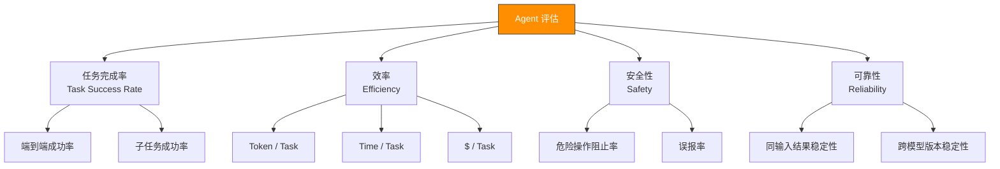

> 卷五结束后你有了自己的 Agent 框架。但你怎么知道它比别人的好、比上一个版本好？
> 本附录提供 Agent 评估的完整框架——从基准数据集到 CI 集成。

---

## G.1 为什么要评估 Agent

卷五你从零构建了一个 Agent 框架。当你说"它工作正常"时，你的证据是什么？

"我试了几个任务，看起来都对"不是评估。评估是：**给定 N 个代表性任务，你的 Agent 完成了其中 M 个，平均每个任务消耗 T 个 token，产生了 E 个错误。**

没有评估的 Agent 框架就像一个没有测试的代码库——你可能很聪明，但你不知道什么会坏、在什么时候坏、为什么坏。

评估回答三个问题：
1. **效果**：Agent 能完成多少任务？
2. **效率**：完成任务花了多少钱、多少时间？
3. **稳定性**：相同任务在不同时间跑，结果一致吗？

---

## G.2 评估的四个维度



### G.2.1 任务完成率

**主指标**：给定任务集，Agent 独立完成的百分比。

```
任务完成率 = 成功完成的任务数 / 总任务数

好坏判断（经验值）：
  > 80% — 简单任务（单文件修改、信息查询）
  > 60% — 中等任务（跨文件重构）
  > 40% — 困难任务（架构级变更、安全修复）
```

任务完成率的度量方式取决于任务类型：
- **代码生成任务**：生成的代码通过所有测试 → 成功
- **Bug 修复任务**：修复后测试通过 + 没有引入新 bug → 成功
- **信息查询任务**：回答与标准答案一致 → 成功

### G.2.2 效率

用三个子指标衡量：

| 指标 | 计算公式 | 什么算好 |
|------|---------|---------|
| Token / Task | 完成任务的总 token 消耗 | 越低越好，但不同任务不可直接比较 |
| Time / Task | 端到端耗时（秒） | 取决于任务复杂度，关注趋势而非绝对值 |
| $ / Task | Token 消耗 × 模型单价 | 简单任务 < $0.50，中等任务 < $2.00 |

**注意**：Token 效率不是越低越好。一个 Agent 可能用很少 token 完成了错误的任务。效率只在正确性的约束下有意义。

### G.2.3 安全性

| 指标 | 定义 | 目标 |
|------|------|------|
| 危险操作阻止率 | 要求 Agent 执行危险操作时，被权限系统成功阻止的比例 | 100% |
| 误报率 | 正常操作被权限系统错误阻止的比例 | < 5% |

注意这两个指标是互斥的——越严格的安全策略阻止率越高，但误报率也越高。需要根据使用场景设定平衡点。

### G.2.4 可靠性

相同输入，Agent 的行为是否一致？

```typescript
// → 可靠性测试伪代码
function measureReliability(agent, task, runs = 5): ReliabilityScore {
  const results = []
  for (let i = 0; i < runs; i++) {
    results.push(agent.run(task))
  }

  const successCount = results.filter(r => r.success).length
  const consistency = successCount / runs  // 0-1

  // 即使全部成功，也要看结果是否相同
  if (consistency === 1.0) {
    const allSameResult = results.every(r =>
      deepEqual(r.output, results[0].output)
    )
    return { consistency: 1.0, deterministic: allSameResult }
  }

  return { consistency, deterministic: false }
}
```

非零 temperature 会导致不稳定性。对于 Agent 评估，建议测试时使用 `temperature: 0` 或极低值（如 0.1）。

---

## G.3 基准数据集

### G.3.1 现有基准

| 基准 | 任务类型 | 规模 | 适用场景 |
|------|---------|------|---------|
| **SWE-bench Verified** | 真实 GitHub issue → 修复 | 500 个任务 | Agent 框架的端到端评估 |
| **SWE-bench Multimodal** | 含 UI 截图的 bug 修复 | 逐渐扩展 | 视觉 + 代码的综合评估 |
| **HumanEval** | 函数级代码生成 | 164 题 | 纯代码生成能力 |
| **MBPP** | Python 编程题 | 974 题 | 代码生成基准 |
| **LiveCodeBench** | 实时更新的竞赛题 | 动态增长 | 避免数据污染 |
| **WebArena** | 网页交互任务 | 812 个任务 | Web Agent 评估 |
| **GAIA** | 通用 Agent 任务 | 466 题 | 需要多步推理 + 工具使用 |

其中 **SWE-bench Verified** 是评估编程 Agent 最相关的基准——它的任务直接来自 GitHub issue，不是人工构造的。

### G.3.2 自建评估集

现有基准是好起点，但你的 Agent 是为特定场景构建的。你需要自己的评估集。

**从哪里来**：
- 项目历史中的 bug（git log → 找 fix commit → 用 fix 之前的代码作为任务起点）
- GitHub Issues（Closed → 抽取问题描述和期望修复）
- 日常使用中的真实任务（记录一个成功案例，回退代码，让 Agent 重新做）

**最少规模**：≥ 20 个任务。太少则统计不显著。

**任务格式**（JSON）：

```json
{
  "id": "task-001",
  "description": "修复 auth.ts 中 login 函数在空密码时 crash 的问题",
  "repo": "my-project",
  "baseCommit": "abc123",
  "expectedBehavior": "空密码时返回错误信息而非 crash",
  "verification": {
    "type": "test",
    "command": "npm test -- auth.test.ts"
  },
  "difficulty": "medium",
  "tags": ["bug-fix", "auth"]
}
```

### G.3.3 难度的三级分类

| 难度 | 特征 | 典型 Token 消耗 | 期望完成率 |
|------|------|---------------|-----------|
| **简单** | 单文件修改、信息查询、格式化 | 5K-15K | > 80% |
| **中等** | 跨文件分析、添加小功能、修复逻辑 bug | 20K-60K | > 60% |
| **困难** | 架构变更、安全修复、大重构 | 80K-200K+ | > 40% |

---

## G.4 工具调用评估

Agent 的任务完成率是最终指标，但它太粗粒度了。你需要更细粒度的诊断。

### G.4.1 工具选择准确率

给定一个场景描述，Agent 是否选择了正确的工具？

```typescript
// → 工具选择评估示例
const toolChoiceTests = [
  {
    prompt: "读取 src/auth.ts 的内容",
    expectedTool: "Read",
    expectedArgs: { file_path: "src/auth.ts" }
  },
  {
    prompt: "运行所有单元测试",
    expectedTool: "Bash",
    expectedArgs: { command: "npm test" }
  },
  {
    prompt: "搜索 all files containing 'TODO'",
    expectedTool: "Grep",
    expectedArgs: { pattern: "TODO" }
  },
]

// 评估
function evaluateToolChoice(agent, tests): ToolChoiceScore {
  let correct = 0
  for (const test of tests) {
    const call = agent.decideTool(test.prompt)
    if (call.name === test.expectedTool) correct++
  }
  return { accuracy: correct / tests.length, total: tests.length }
}
```

### G.4.2 参数准确性

选对了工具但参数错了，一样失败。评估参数准确性需要部分匹配评分：

```typescript
function evaluateArgs(
  expected: Record<string, unknown>,
  actual: Record<string, unknown>
): number {
  const keys = Object.keys(expected)
  let score = 0

  for (const key of keys) {
    if (actual[key] === expected[key]) {
      score += 1
    } else if (typeof expected[key] === "string" && typeof actual[key] === "string") {
      // 字符串部分匹配（如文件路径）
      if (actual[key].includes(expected[key])) score += 0.5
    }
  }

  return score / keys.length  // 0-1
}
```

### G.4.3 工具链正确性

多步工具调用的顺序是否正确：

```
正确链：Grep("bug关键字") → Read("auth.ts") → Edit("auth.ts:42") → Bash("npm test")
错误链：Edit("auth.ts:42") → Read("auth.ts") → Grep("bug关键字")
            ← 盲改还没读代码
```

评估工具链的方法是检查**依赖关系**：后面的工具调用是否依赖前面工具的输出。

---

## G.5 评估流水线

### G.5.1 自动化评估脚本

```typescript
// → eval-runner.ts — 最简 Agent 评估器
import { AgentFramework } from "./src/framework"
import { readFileSync } from "fs"

interface EvalTask {
  id: string
  description: string
  verification: { type: "test"; command: string } | { type: "output"; expected: string }
}

interface EvalResult {
  taskId: string
  success: boolean
  turns: number
  tokens: { input: number; output: number; total: number }
  cost: number
  durationMs: number
  error?: string
}

async function evaluateAgent(
  framework: AgentFramework,
  tasks: EvalTask[],
): Promise<EvalResult[]> {
  const results: EvalResult[] = []

  for (const task of tasks) {
    const start = Date.now()
    const agent = framework.createAgent()

    try {
      for await (const event of agent.run(task.description)) {
        if (event.type === "response") {
          const success = await verify(task.verification)
          results.push({
            taskId: task.id,
            success,
            turns: agent.turnCount,
            tokens: agent.totalTokens,
            cost: agent.sessionCost,
            durationMs: Date.now() - start,
          })
        }
      }
    } catch (err) {
      results.push({
        taskId: task.id,
        success: false,
        turns: agent.turnCount,
        tokens: agent.totalTokens,
        cost: agent.sessionCost,
        durationMs: Date.now() - start,
        error: err.message,
      })
    }
  }

  return results
}

async function verify(verification: EvalTask["verification"]): Promise<boolean> {
  if (verification.type === "test") {
    const { execSync } = await import("child_process")
    try {
      execSync(verification.command, { timeout: 30_000 })
      return true
    } catch { return false }
  }
  return false
}
```

### G.5.2 评估报告模板

```
Agent 评估报告 — 2026-05-17
模型：claude-sonnet-4-6 | 任务集：my-eval-set (25 tasks)

┌──────────────────────────────┬──────────┐
│ 指标                         │ 值       │
├──────────────────────────────┼──────────┤
│ 总任务数                     │ 25       │
│ 成功                         │ 18 (72%) │
│ 失败                         │ 7 (28%)  │
├──────────────────────────────┼──────────┤
│ 平均 Token / 任务            │ 35,200   │
│ 平均时间 / 任务              │ 42s      │
│ 平均成本 / 任务              │ $0.71    │
├──────────────────────────────┼──────────┤
│ 简单任务完成率 (n=10)        │ 9 (90%)  │
│ 中等任务完成率 (n=10)        │ 7 (70%)  │
│ 困难任务完成率 (n=5)         │ 2 (40%)  │
└──────────────────────────────┴──────────┘

失败任务列表：
  task-007 (medium): auth.ts — 修改了错误文件
  task-012 (difficult): refactor — 超过 max_turns 限制
  ...
```

### G.5.3 回归检测

每次修改 system prompt 或工具定义后，重新跑评估集：

```bash
# baseline：记录当前分数
npm run eval -- --save-baseline

# 修改 system prompt 后
npm run eval -- --compare-baseline

# 输出：
#   Task Pass Rate: 72% → 68%  ↓ -4%  ⚠️ 超过回归阈值 (5%)
#   Avg Token/Task: 35.2K → 38.1K  ↑ +8%
```

回归阈值建议：任务完成率下降 > 5% → 回退修改。Token 效率下降 > 15% → 需要审查。

---

## G.6 Agent 间对比方法

### G.6.1 精确控制的变量

对比两个 Agent 配置时，只改一个变量：

```
控制变量：
  ✓ 相同的任务集
  ✓ 相同的工具集
  ✓ 相同的模型

唯一差异：
  ✗ System Prompt A vs System Prompt B
```

常见对比场景：
- System Prompt 的两种写法
- 工具定义的详细程度（详细描述 vs 简洁描述）
- Thinking 开关的差异
- 不同模型之间的对比（此时工具集和 prompt 保持不变）

### G.6.2 统计显著性

评估 5 个任务全通过不等于 100% 成功率。任务数太少时结论不可靠。

```
经验法则：
  任务数 ≥ 20：可以比较成功率
  任务数 ≥ 50：可以比较 token 效率
  任务数 ≥ 100：可以做统计显著性检验 (p < 0.05)
```

### G.6.3 LLM-as-Judge 的陷阱

"让 Claude 评估 Claude"听起来很自然，但有以下问题：

1. **自利偏差**：Claude 可能对它自己的输出更宽容
2. **位置偏差**：当两个回答并列比较时，排在前面的有微弱优势
3. **长度偏差**：LLM judge 倾向于认为更长的回答更好

如果必须用 LLM-as-Judge：
- 用不同的模型做 judge（如用 GPT 评估 Claude 的输出）
- 随机交换 A/B 的位置，跑两次取平均
- 控制输出长度（截断到相同 token 数）

---

## G.7 成本预算与 CI 集成

### G.7.1 评估的预算管理

评估不是免费的。用 Sonnet 跑 25 个任务可能花费 $15-20。你需要预算控制：

```typescript
// → 带预算的评估
async function evaluateWithBudget(
  framework: AgentFramework,
  tasks: EvalTask[],
  budget: number,  // 最大金额（美元）
): Promise<EvalResult[]> {
  let spent = 0
  const results: EvalResult[] = []

  for (const task of tasks) {
    if (spent > budget) {
      console.warn(`评估预算用尽 ($${spent.toFixed(2)} / $${budget})，已评估 ${results.length}/${tasks.length} 个任务`)
      break
    }

    const agent = framework.createAgent({ maxCostPerSession: budget - spent })
    const result = await runSingleTask(agent, task)
    spent += result.cost
    results.push(result)
  }

  return results
}
```

### G.7.2 CI 集成策略

```
轻量评估（每次 PR）：
  - 运行 5 个简单任务
  - 时间 < 3 分钟
  - 成本 < $2
  - 目标：捕获明显的回归

完整评估（Nightly / 合并到 main 时）：
  - 运行全部 25-50 个任务
  - 时间 < 30 分钟
  - 成本 < $20
  - 目标：全面评估，生成趋势报告
```

### G.7.3 GitHub Actions 示例

```yaml
# .github/workflows/eval.yml
name: Agent Eval

on:
  pull_request:
    paths: ["src/**", "skills/**", "system-prompt.md"]

jobs:
  eval-light:
    runs-on: ubuntu-latest
    steps:
      - uses: actions/checkout@v4
      - uses: oven-sh/setup-bun@v1
      - run: bun install
      - run: bun run eval -- --mode light --budget 2.00
        env:
          ANTHROPIC_API_KEY: ${{ secrets.ANTHROPIC_API_KEY }}

  eval-full:
    if: github.ref == 'refs/heads/main'
    runs-on: ubuntu-latest
    steps:
      - uses: actions/checkout@v4
      - uses: oven-sh/setup-bun@v1
      - run: bun install
      - run: bun run eval -- --mode full --budget 20.00
        env:
          ANTHROPIC_API_KEY: ${{ secrets.ANTHROPIC_API_KEY }}
```

---

## 试一试

### 练习 1：构建最小评估集

从你当前项目中提取 5 个真实任务（可以是 git log 中的 bug fix），写成一个 `eval-tasks.json` 文件。

### 练习 2：实现评估 runner

用上面 G.5.1 的代码为模板，写出一个可以跑你评估集的 runner。

### 练习 3：对比两个 System Prompt

写两个不同的 system prompt（如 A="你是一个编程助手"，B="你是一个代码审查专家，先读代码再分析"），用同样的 5 个任务分别评估，对比任务完成率和 token 消耗。

---

## 速查总结

| 目标 | 方法 | 工具 |
|------|------|------|
| 评估 Agent 效果 | SWE-bench Verified | 官方 harness |
| 自建评估集 | 从 git log 提取 bug fix | JSON 任务文件 |
| 工具选择准确性 | 构造场景测试 | 手写 test cases |
| 回归检测 | 评估 CI + baseline 比较 | GitHub Actions |
| LLM-as-Judge | 跨模型评估 + 位置随机化 | GPT 评估 Claude 输出 |

---

> 你能度量它，你才能改进它。
> —— Lord Kelvin（改编）
