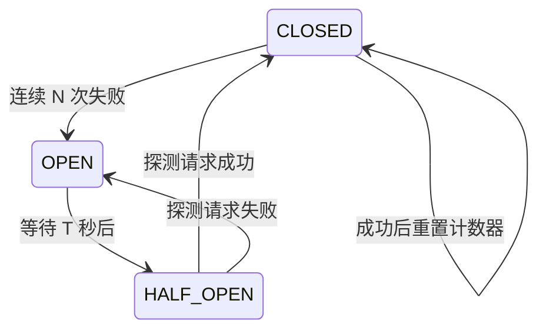

> 卷五结束后你有了自己的 Agent 框架。现在你需要持续迭代它，并安全地交付给用户。
> 本附录覆盖版本策略、CI 流水线、金丝雀发布和配置管理。

---

## H.1 什么需要版本管理

Agent 框架不是静态代码。它的"行为"由好几层组成，每一层都应该有版本。

| 层次 | 版本策略 | 示例 |
|------|---------|------|
| 框架代码 | Semantic Versioning (MAJOR.MINOR.PATCH) | `1.2.0` |
| System Prompt | 内容 hash (SHA256) | `prompt/a3f2b1c` |
| 工具定义 | Schema hash | `tools/Read@v2.1` |
| Skill 定义 | YAML 文件 + git tag | `skills/code-review@v1.0.0` |
| 配置文件 | 分环境管理 + git | `settings.prod.json` |

### 为什么 System Prompt 需要版本

修改了一个形容词（"你是一个**编程**助手" → "你是一个**代码审查**专家"），Agent 的行为可能完全改变。没有版本号，你不知道生产环境跑的是哪个版本。

```typescript
// → System Prompt 的版本管理
const SYSTEM_PROMPTS = {
  "v1.0.0": {
    hash: "sha256:a3f2b1c...",
    content: "你是一个编程助手。",
    released: "2026-05-01",
  },
  "v1.1.0": {
    hash: "sha256:d4e5f6a...",
    content: "你是一个代码审查专家。先读代码再分析。",
    released: "2026-05-15",
  },
}

function getActivePrompt(): string {
  // 从配置中读取当前激活的版本
  const version = config.get("systemPromptVersion") ?? "v1.0.0"
  return SYSTEM_PROMPTS[version].content
}
```

### 配置回退机制

新配置上线后出问题了怎么办？**需要一键回退**：

```bash
# 回退到上一个配置版本
git revert HEAD -- settings.json
git push

# 或者通过环境变量覆盖
export AGENT_SYSTEM_PROMPT_VERSION=v1.0.0
```

---

## H.2 CI 流水线设计

### H.2.1 轻量 CI（每次 PR）

每一步失败就停止，不消耗不必要的 CI 分钟和 API 费用。

```yaml
# .github/workflows/ci-light.yml
name: CI (Light)

on:
  pull_request:
    paths: ["src/**", "package.json", "tsconfig.json"]

jobs:
  lint-and-typecheck:
    runs-on: ubuntu-latest
    steps:
      - uses: actions/checkout@v4
      - uses: oven-sh/setup-bun@v1
      - run: bun install --frozen-lockfile
      - run: bun run lint           # ESLint / biome
      - run: bun run typecheck      # tsc --noEmit

  test:
    runs-on: ubuntu-latest
    steps:
      - uses: actions/checkout@v4
      - uses: oven-sh/setup-bun@v1
      - run: bun install --frozen-lockfile
      - run: bun test               # vitest --reporter=verbose
```

预计耗时：< 2 分钟。

### H.2.2 完整 CI（合并到 main 时）

```yaml
# .github/workflows/ci-full.yml
name: CI (Full)

on:
  push:
    branches: [main]

jobs:
  integration:
    runs-on: ubuntu-latest
    timeout-minutes: 15
    steps:
      - uses: actions/checkout@v4
      - uses: oven-sh/setup-bun@v1
      - run: bun install --frozen-lockfile
      - run: bun run test:integration  # 真实 API 调用
        env:
          ANTHROPIC_API_KEY: ${{ secrets.ANTHROPIC_API_KEY }}

  eval-light:
    runs-on: ubuntu-latest
    timeout-minutes: 10
    steps:
      - uses: actions/checkout@v4
      - uses: oven-sh/setup-bun@v1
      - run: bun install --frozen-lockfile
      - run: bun run eval -- --mode light --tasks 5 --budget 2.00
        env:
          ANTHROPIC_API_KEY: ${{ secrets.ANTHROPIC_API_KEY }}

  eval-full:
    runs-on: ubuntu-latest
    timeout-minutes: 30
    steps:
      - uses: actions/checkout@v4
      - uses: oven-sh/setup-bun@v1
      - run: bun install --frozen-lockfile
      - run: bun run eval -- --mode full --tasks 25 --budget 20.00
        env:
          ANTHROPIC_API_KEY: ${{ secrets.ANTHROPIC_API_KEY }}
```

预计耗时：5-30 分钟。成本：$2-22。

### H.2.3 CI 中的 API Key 安全

- 永远使用 GitHub Secrets，不在代码中写 API key
- 为 CI 创建专用的 API key，设置使用限额
- 为 CI 创建的 API key 只给必要权限

---

## H.3 金丝雀发布与 A/B 测试

### H.3.1 System Prompt 的 A/B 测试

```typescript
// → A/B 测试分流
class PromptABTester {
  private variants: Map<string, { prompt: string; traffic: number }>

  constructor() {
    this.variants = new Map([
      ["A", { prompt: "你是一个编程助手。", traffic: 0.95 }],
      ["B", { prompt: "你是一个代码审查专家。先读再分析。", traffic: 0.05 }],
    ])
  }

  getVariant(sessionId: string): string {
    // 确定性分流：同一会话始终同一 variant
    const hash = this.hashString(sessionId)
    const roll = hash % 100 / 100  // 0-1

    let cumulative = 0
    for (const [name, variant] of this.variants) {
      cumulative += variant.traffic
      if (roll <= cumulative) return variant.prompt
    }

    return this.variants.get("A")!.prompt  // fallback
  }

  private hashString(s: string): number {
    let hash = 0
    for (let i = 0; i < s.length; i++) {
      hash = ((hash << 5) - hash) + s.charCodeAt(i)
      hash |= 0
    }
    return Math.abs(hash)
  }
}

// 使用
const tester = new PromptABTester()
const prompt = tester.getVariant(sessionId)
```

### H.3.2 金丝雀发布流程

```
第 1 天：B 版本给 5% 用户
  → 监控 24h，对比 A/B 的任务完成率和 token 效率
  → 如果 B 显著差，回退

第 3 天：B 版本给 25% 用户
  → 再监控 24h

第 5 天：B 版本给 100% 用户
  → B 变成新的 A
  → 旧的 A 存档
```

### H.3.3 自动回滚条件

```typescript
// → 自动回滚守卫
function shouldRollback(
  variantAMetrics: AgentMetrics,
  variantBMetrics: AgentMetrics,
): boolean {
  // 条件 1：任务完成率下降 > 5%
  if (variantBMetrics.taskSuccessRate < variantAMetrics.taskSuccessRate - 0.05) {
    console.error("ROLLBACK: 任务完成率下降 > 5%")
    return true
  }

  // 条件 2：Token 消耗增加 > 30%
  if (variantBMetrics.avgTokensPerTask > variantAMetrics.avgTokensPerTask * 1.3) {
    console.error("ROLLBACK: Token 消耗增加 > 30%")
    return true
  }

  // 条件 3：错误率翻倍
  if (variantBMetrics.errorRate > variantAMetrics.errorRate * 2) {
    console.error("ROLLBACK: 错误率翻倍")
    return true
  }

  return false
}
```

---

## H.4 配置管理

### H.4.1 分环境配置

```typescript
// → config/loader.ts
import { readFileSync } from "fs"

interface AgentConfig {
  model: string
  maxTokens: number
  maxTurns: number
  maxCostPerSession: number
  caching: boolean
  thinking: "off" | "adaptive" | { budget: number }
}

function loadConfig(): AgentConfig {
  const env = process.env.AGENT_ENV ?? "development"

  // 1. 基础配置
  const base: AgentConfig = {
    model: "claude-sonnet-4-6",
    maxTokens: 32_000,
    maxTurns: 25,
    maxCostPerSession: 5.00,
    caching: true,
    thinking: "adaptive",
  }

  // 2. 环境特定配置
  const envOverrides: Record<string, Partial<AgentConfig>> = {
    development: {
      maxCostPerSession: 0.50,    // 开发时省钱
      thinking: "off",             // 关掉 thinking 加速
    },
    staging: {
      model: "claude-haiku-4-5",  // staging 用便宜模型
      maxCostPerSession: 2.00,
    },
    production: {
      model: "claude-sonnet-4-6",
      maxCostPerSession: 10.00,
    },
  }

  // 3. 环境变量覆盖（最高优先级）
  const envOverrides2: Partial<AgentConfig> = {}
  if (process.env.AGENT_MODEL) envOverrides2.model = process.env.AGENT_MODEL
  if (process.env.AGENT_MAX_COST) envOverrides2.maxCostPerSession = parseFloat(process.env.AGENT_MAX_COST)

  return { ...base, ...envOverrides[env], ...envOverrides2 }
}
```

### H.4.2 配置与代码的兼容矩阵

当框架代码升级时，配置文件可能也需要升级：

| 框架版本 | 配置 Schema 版本 | 兼容性 |
|---------|----------------|--------|
| 1.0.0 | config-v1 | — |
| 1.1.0 | config-v1 | 兼容 |
| 2.0.0 | config-v2 | 不兼容（需要迁移） |

```typescript
// → 配置迁移
const MIGRATIONS: Record<string, (old: any) => any> = {
  "config-v1→config-v2": (old) => ({
    ...old,
    maxTurns: old.maxTurns ?? 25,          // 新增字段，给默认值
    caching: old.caching ?? true,
    // 删除字段：old.debugMode (不再支持)
  }),
}

function migrateConfig(config: any, from: string, to: string): any {
  const key = `${from}→${to}`
  const migration = MIGRATIONS[key]
  if (!migration) throw new Error(`未知的迁移路径: ${key}`)
  return migration(config)
}
```

---

## H.4.5 生产韧性 — Graceful Shutdown、健康检查、熔断器

CI/CD 保证代码能部署。但部署之后呢？Agent 在 K8s 上运行时，可能被随时杀死（Pod eviction）、被流量压垮、被 API 故障拖死。生产韧性需要三道防线。

### Graceful Shutdown

Kubernetes 发 SIGTERM → 你的 Agent 有 30 秒优雅关闭窗口：

```typescript
// → src/my-agent/shutdown.ts
class GracefulShutdown {
  private shuttingDown = false
  private activeTasks = new Set<string>()

  constructor(private agent: AgentLoop) {
    // 监听 SIGTERM / SIGINT
    process.on("SIGTERM", () => this.handleShutdown("SIGTERM"))
    process.on("SIGINT", () => this.handleShutdown("SIGINT"))
  }

  private async handleShutdown(signal: string): Promise<void> {
    if (this.shuttingDown) {
      console.warn(`收到第二次 ${signal}，强制退出`)
      process.exit(1)  // 第二次信号直接退出
    }

    this.shuttingDown = true
    console.log(`收到 ${signal}，等待 ${this.activeTasks.size} 个活跃任务完成...`)

    // 1. 停止接收新请求
    server.close()

    // 2. 等待当前 turn 完成（最多 25 秒）
    const timeout = setTimeout(() => {
      console.error("优雅关闭超时，强制退出")
      process.exit(1)
    }, 25_000)

    // 3. 保存当前状态
    await this.agent.saveSnapshot()
    console.log("状态已保存")

    clearTimeout(timeout)
    process.exit(0)
  }

  // 每个工具调用前后更新活跃任务计数
  trackTask(taskId: string): () => void {
    this.activeTasks.add(taskId)
    return () => this.activeTasks.delete(taskId)  // 返回清理函数
  }
}

// 使用
const shutdown = new GracefulShutdown(agent)
const done = shutdown.trackTask("read-auth")
// ... 执行工具 ...
done()  // 标记完成
```

### 健康检查端点

```typescript
// → 健康检查：K8s liveness / readiness probe
import express from "express"

const app = express()

// Liveness：进程活着
app.get("/health", (_, res) => {
  res.json({ status: "ok", uptime: process.uptime() })
})

// Readiness：能处理请求
app.get("/ready", async (_, res) => {
  const checks = await Promise.all([
    checkApiKey().then(() => "api").catch(() => null),
    checkMcpConnections().then(() => "mcp").catch(() => null),
    checkModelAccess().then(() => "model").catch(() => null),
  ])

  const failed = checks.filter(c => c === null)
  if (failed.length > 0) {
    res.status(503).json({
      status: "not_ready",
      failed: checks.map((c, i) => c === null ? ["api","mcp","model"][i] : null).filter(Boolean),
    })
    return
  }

  res.json({ status: "ready" })
})

// 健康检查实现
async function checkApiKey(): Promise<void> {
  // 发一个 max_tokens=0 的空请求（等同缓存预热）
  await client.createMessage({
    model: "claude-haiku-4-5",
    max_tokens: 0,
    messages: [{ role: "user", content: "ping" }],
  })
}

async function checkMcpConnections(): Promise<void> {
  for (const [name, mcp] of mcpClients) {
    await mcp.ping()  // 每个 MCP 连接发心跳
  }
}
```

### 熔断器 (Circuit Breaker)

当 API 连续失败时，熔断器防止雪崩：

```typescript
// → src/my-agent/circuit-breaker.ts
type CircuitState = "CLOSED" | "OPEN" | "HALF_OPEN"

class CircuitBreaker {
  private state: CircuitState = "CLOSED"
  private failures = 0
  private lastFailureTime = 0

  constructor(
    private threshold = 5,        // 连续 5 次失败 → 熔断
    private resetTimeout = 30_000, // 30 秒后尝试半开
  ) {}

  async call<T>(fn: () => Promise<T>): Promise<T> {
    if (this.state === "OPEN") {
      if (Date.now() - this.lastFailureTime < this.resetTimeout) {
        throw new CircuitOpenError("熔断器已打开，拒绝请求")
      }
      this.state = "HALF_OPEN"  // 超时了，试试半开
    }

    try {
      const result = await fn()
      this.onSuccess()
      return result
    } catch (err) {
      this.onFailure()
      throw err
    }
  }

  private onSuccess(): void {
    this.failures = 0
    this.state = "CLOSED"
  }

  private onFailure(): void {
    this.failures++
    this.lastFailureTime = Date.now()
    if (this.failures >= this.threshold) {
      this.state = "OPEN"
      console.error(`熔断器打开：连续 ${this.failures} 次失败`)
    }
  }
}

class CircuitOpenError extends Error {
  constructor(msg: string) { super(msg) }
}

// 集成到 ApiClient
const breaker = new CircuitBreaker(5, 30_000)

async function safeApiCall(params: MessageCreateParams): Promise<MessageResponse> {
  return breaker.call(() => client.createMessage(params))
}
```

熔断器三态转换：



---

### 告警阈值与 Runbook

前面讲了 Graceful Shutdown、健康检查、熔断器。但凌晨 3 点出故障时，谁会醒来？他们能多快定位问题？

**告警阈值配置**：

```yaml
# alerts.yml — 告警规则
alerts:
  - name: high_error_rate
    metric: agent.tool.error_rate
    threshold: "> 5%"
    window: 5m
    severity: critical
    message: "Agent 工具调用错误率超过 5%"

  - name: high_cost_rate
    metric: agent.session.cost_per_minute
    threshold: "> $2/min"
    window: 10m
    severity: warning
    message: "Agent 成本异常升高"

  - name: api_unhealthy
    metric: agent.health.api_status
    threshold: "!= ok"
    window: 2m
    severity: critical
    message: "API 不可用"

  - name: circuit_open
    metric: agent.circuit.state
    threshold: "== OPEN"
    severity: critical
    message: "熔断器已打开"

  - name: high_loop_count
    metric: agent.turn.count_p95
    threshold: "> 20"
    window: 15m
    severity: warning
    message: "P95 循环次数 > 20，可能存在死循环"
```

**告警升级策略**：

```
Critical 告警触发:
  T+0min   → PagerDuty 通知值班 SRE
  T+10min  → 无响应 → 升级到 Team Lead
  T+30min  → 无响应 → 升级到 Engineering Manager

Warning 告警触发:
  T+0min   → Slack #agent-alerts 频道
  T+60min  → 未解决 → 升级为 Critical
```

**Incident Runbook 模板**：

```markdown
# Incident: [告警名称]

## 1. 确认故障 (2 分钟)
- [ ] 检查 Grafana dashboard: agent-health
- [ ] 检查 Anthropic Status: https://status.anthropic.com
- [ ] 检查 K8s pod: kubectl get pods -l app=agent

## 2. 分类 (3 分钟)

### 如果 API 不可用 (anthropic status != green)
→ 这是上游故障，无操作可做
→ 通知 #incidents: "Anthropic API 不可用，等待恢复"
→ 如果持续 > 30min，考虑切换到备选模型

### 如果错误率升高 (api is green)
→ 检查最近的部署: kubectl describe deployment agent
→ 如果是 5 分钟内的部署 → 立即回滚: kubectl rollout undo deployment agent
→ 检查日志: kubectl logs -l app=agent --tail=100 | grep ERROR

### 如果熔断器打开
→ 检查 API latency: Grafana → agent-api-latency
→ 如果 P95 > 5s → API 慢，不是你的问题
→ 如果 P95 < 1s → 可能是某类请求 100% 失败，检查日志

## 3. 缓解 (5 分钟)
- [ ] 回滚最近部署 (如果适用)
- [ ] 切换到备选模型 (如果 API 故障)
- [ ] 扩容: kubectl scale deployment agent --replicas=N+2

## 4. 恢复验证
- [ ] 错误率回到基线
- [ ] 熔断器关闭
- [ ] 健康检查通过

## 5. 事后
- [ ] 写 Postmortem (模板: docs/postmortems/template.md)
- [ ] 如果是代码问题: 开 Issue
- [ ] 如果是配置问题: 更新 runbook
```

---

## H.5 版本发布 Checklist

发布新版本前：

```
□ 所有测试通过（bun test）
□ 类型检查通过（tsc --noEmit）
□ 轻量评估通过（5 个任务，无回归）
□ Changelog 已更新
□ 如果涉及 System Prompt 变更：标注新 hash
□ 如果涉及工具定义变更：标注新 schema hash
□ 如果涉及破坏性变更：MAJOR 版本号 + 迁移指南
□ git tag 已创建（git tag v1.2.0 && git push --tags）
```

---

## 试一试

1. **为你的框架设置 CI**。从上面的 GitHub Actions 模板开始，至少加入 lint + typecheck + test。
2. **实现 A/B 测试**。写一个 `PromptABTester` 类，用 sessionId hash 做确定性分流。
3. **设计配置迁移**。设想 v1 到 v2 的配置变更，写出迁移函数。

---

> 好的 CI/CD 不是一个负担——它是让你敢于频繁修改的底气。
